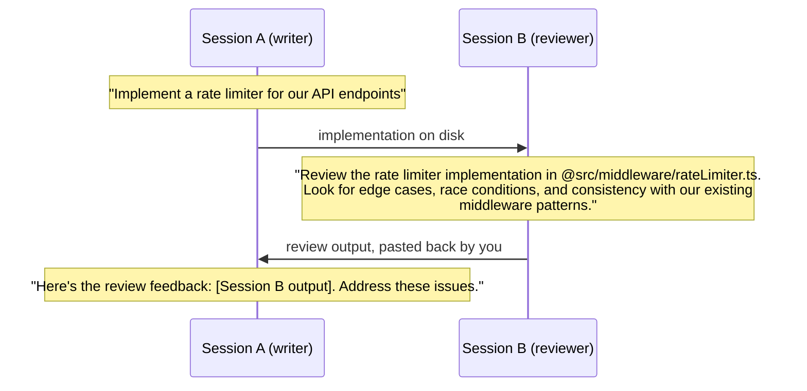

# Claude Code Best Practices: Reference

Source: https://code.claude.com/docs/en/best-practices

## Contents
1. Verification
2. Explore → Plan → Implement → Commit
3. Writing prompts
4. Configuring the environment
5. Managing the session
6. Automate and scale
7. Common failure patterns
8. Developing intuition

---

## 1. Verification

Without a check Claude can run, "looks done" is the only signal, and the user becomes the verification loop.

| Strategy | ✗ Before | ✓ After |
|---|---|---|
| Give verification criteria | *"implement a function that validates email addresses"* | *"write a validateEmail function. example test cases: user@example.com is true, invalid is false, user@.com is false. run the tests after implementing"* |
| Verify UI visually | *"make the dashboard look better"* | *"[paste screenshot] implement this design. take a screenshot of the result and compare it to the original. list differences and fix them"* |
| Address root causes | *"the build is failing"* | *"the build fails with this error: [paste error]. fix it and verify the build succeeds. address the root cause, don't suppress the error"* |

How hard the check gates the stop (more setup, less attention needed):

| Gate | Mechanism |
|---|---|
| In one prompt | Ask Claude to run the check and iterate. Works on any task. |
| Across a session | A [`/goal`](https://code.claude.com/docs/en/goal) condition: a separate evaluator re-checks after every turn. If Claude stalls, the run stops with the goal still set. |
| Deterministic | A [Stop hook](https://code.claude.com/docs/en/hooks#stop) runs the check as a script and blocks the turn from ending until it passes (consecutive blocks are capped). |
| Second opinion | A [verification subagent](https://code.claude.com/docs/en/sub-agents) or [dynamic workflow](https://code.claude.com/docs/en/workflows), so the agent doing the work isn't the one grading it. |

* After Claude's check passes, the user runs `/verify` to confirm against the running app.
* Ask for evidence, not assertions: the test output, the command and its result, or a screenshot.

---

## 2. Explore → Plan → Implement → Commit

Plan when the approach is uncertain, the change touches several files, or the code is unfamiliar. If the diff fits in one sentence, skip the plan.

| Phase | How | Example prompt |
|---|---|---|
| Explore | Plan mode: `Shift+Tab` until `⏸ plan mode on`, or `claude --permission-mode plan`. Claude reads without changing anything. | *"read /src/auth and understand how we handle sessions and login. also look at how we manage environment variables for secrets."* |
| Plan | `Ctrl+G` edits the plan in your text editor before Claude proceeds. | *"I want to add Google OAuth. What files need to change? What's the session flow? Create a plan."* |
| Implement | Approve the plan, or `Shift+Tab` out of plan mode. | *"implement the OAuth flow from your plan. write tests for the callback handler, run the test suite and fix any failures."* |
| Commit | | *"commit with a descriptive message and open a PR"* |

### Let Claude interview you

For larger features, start minimal and let Claude ask:

```text
I want to build [brief description]. Interview me in detail using the AskUserQuestion tool.

Ask about technical implementation, UI/UX, edge cases, concerns, and tradeoffs. Don't ask obvious questions, dig into the hard parts I might not have considered.

Keep interviewing until we've covered everything, then write a complete spec to SPEC.md.
```

* Then implement in a **fresh session**.
* The best specs are self-contained: they name the files and interfaces, state what's out of scope, and end with an end-to-end verification step. Time spent making the spec precise pays off more than time spent watching the implementation.

---

## 3. Writing prompts

| Strategy | ✗ Before | ✓ After |
|---|---|---|
| Scope the task: file, scenario, testing preferences | *"add tests for foo.py"* | *"write a test for foo.py covering the edge case where the user is logged out. avoid mocks."* |
| Point to sources | *"why does ExecutionFactory have such a weird api?"* | *"look through ExecutionFactory's git history and summarize how its api came to be"* |
| Reference existing patterns | *"add a calendar widget"* | *"look at how existing widgets are implemented on the home page. HotDogWidget.php is a good example. follow the pattern to implement a calendar widget where the user selects a month and paginates by year. no libraries beyond the ones already used."* |
| Describe the symptom: symptom, likely location, what "fixed" means | *"fix the login bug"* | *"users report that login fails after session timeout. check the auth flow in src/auth/, especially token refresh. write a failing test that reproduces the issue, then fix it"* |

* Vague prompts are fine when exploring and you can afford to course-correct: *"what would you improve in this file?"*
* Ways to give Claude rich content:
   * `@path/to/file`: Claude reads the file before responding.
   * Images: paste or drag and drop.
   * URLs for docs and API references. Allowlist frequent domains with `/permissions`.
   * Piped data: `cat error.log | claude -p "explain this error"`.
   * Let Claude fetch it itself, through Bash, MCP tools or file reads.
* Codebase questions need no special prompting and are good for onboarding: *"How does logging work?"*, *"Why does this code call `foo()` instead of `bar()` on line 333?"*

---

## 4. Configuring the environment

### Choosing a mechanism

| Need | Use |
|---|---|
| Broad rules for every session | `CLAUDE.md`, kept short |
| Domain knowledge or workflows needed only sometimes | Skill: `.claude/skills/<name>/SKILL.md`, loaded on demand (see the `building-skills` skill) |
| Must happen every time, no exceptions | Hook in `.claude/settings.json`: deterministic, unlike advisory `CLAUDE.md` |
| Isolated, specialized tasks (review, research) | Subagent: `.claude/agents/<name>.md`, with its own context and tools |
| External systems (issue trackers, databases, Figma) | MCP server, or a CLI tool |
| Fewer permission prompts | Allowlist, sandbox, auto mode |
| Bundled skills, hooks, agents and MCP servers | Plugin |

More: [Extend Claude Code](https://code.claude.com/docs/en/features-overview#match-features-to-your-goal).

### CLAUDE.md

* Read at the start of every conversation. `/init` generates a starter; `/context` confirms it loaded.
* **For each line ask: "Would removing this cause Claude to make mistakes?" If not, cut it.** A bloated file makes Claude ignore the instructions that matter.
* How to write the lines that stay: [high-quality-tokens](../high-quality-tokens/SKILL.md).

| ✓ Include | ✗ Exclude |
|---|---|
| Bash commands Claude can't guess | Anything Claude can figure out by reading code |
| Code style rules that differ from defaults | Standard language conventions Claude already knows |
| Testing instructions and preferred test runners | Detailed API documentation (link to it instead) |
| Repository etiquette (branch naming, PR conventions) | Information that changes frequently |
| Architectural decisions specific to the project | Long explanations or tutorials |
| Environment quirks (required env vars) | File-by-file descriptions of the codebase |
| Common gotchas and non-obvious behavior | Self-evident practices like "write clean code" |

```markdown
# Code style
- Use ES modules (import/export) syntax, not CommonJS (require)
- Destructure imports when possible (eg. import { foo } from 'bar')

# Workflow
- Be sure to typecheck when you're done making a series of code changes
- Prefer running single tests, and not the whole test suite, for performance
```

| Symptom | Likely cause / fix |
|---|---|
| Claude keeps ignoring a rule | The file is too long and the rule gets lost |
| Claude asks questions the file already answers | The phrasing is ambiguous |
| Claude keeps skipping one instruction | Add `IMPORTANT` to that line only; emphasizing many lines makes none stand out |
| Claude already does it right without the rule | Delete the rule, or turn it into a hook |

* Treat it like code: check it into git, review it when things go wrong, prune regularly, test that behavior actually changes.
* For a checked-in `CLAUDE.md`, `/doctor` proposes cuts for content Claude can derive from the codebase.
* Import other files with `@path/to/import` ([CLAUDE.md files](https://code.claude.com/docs/en/memory#claude-md-files)).
* Customize compaction: *"When compacting, always preserve the full list of modified files and any test commands"*.

### Permissions

Current defaults: [permission modes](https://code.claude.com/docs/en/permission-modes).

| Option | Behavior |
|---|---|
| Auto mode | A classifier reviews actions and blocks only what looks risky: scope escalation, unknown infrastructure, hostile-content-driven actions |
| Manual mode | Asks before actions that might modify the system (file writes, Bash, MCP tools). Safe, but after the tenth approval you're clicking through, not reviewing |
| Allowlists (`/permissions`) | Pre-approve tools known to be safe, like `npm run lint` or `git commit` |
| Sandboxing (`/sandbox`) | OS-level filesystem and network isolation; sandboxed commands run without asking |

Allowlists and sandboxing apply in both manual and auto mode.

### CLI tools, MCP, hooks, subagents, plugins

* **CLI tools** are the most context-efficient way to reach external services. Install `gh`: Claude uses it for issues, PRs and comments, and unauthenticated GitHub API requests often hit rate limits. To teach an unknown tool: *"Use 'foo-cli-tool --help' to learn about foo tool, then use it to solve A, B, C."*
* **MCP servers** connect issue trackers, databases, monitoring, Figma and workflow automation:

```bash
claude mcp add --transport http notion https://mcp.notion.com/mcp
```

* **Hooks** are deterministic scripts at fixed points in the workflow; they guarantee the action happens. Claude can write them: *"Write a hook that runs eslint after every file edit"*, *"Write a hook that blocks writes to the migrations folder."* Configure in `.claude/settings.json`; browse with `/hooks`.
* **Skills:** see the `building-skills` skill.
* **Subagents** run in their own context with their own tools. Invoke explicitly: *"Use a subagent to review this code for security issues."* File `.claude/agents/security-reviewer.md`:

```markdown
---
name: security-reviewer
description: Reviews code for security vulnerabilities
tools: Read, Grep, Glob, Bash
model: opus
---
You are a senior security engineer. Review code for:
- Injection vulnerabilities (SQL, XSS, command injection)
- Authentication and authorization flaws
- Secrets or credentials in code
- Insecure data handling

Provide specific line references and suggested fixes.
```

* **Plugins:** `/plugin` browses the marketplace. For typed languages, a [code intelligence plugin](https://code.claude.com/docs/en/plugins/code-intelligence) adds precise symbol navigation and automatic error detection after edits.

---

## 5. Managing the session

| Action | How |
|---|---|
| Stop mid-action, keep context | `Esc` |
| Restore conversation, code, or both | `Esc Esc` or `/rewind` |
| Condense later messages, keep earlier ones | `/rewind` → checkpoint → **Summarize from here** |
| Condense earlier messages, keep recent ones | `/rewind` → checkpoint → **Summarize up to here** |
| Revert Claude's changes | *"Undo that"* |
| Reset context between unrelated tasks | `/clear` |
| Compact with a focus | `/compact Focus on the API changes` |
| Side question without growing context | `/btw` |
| Name a session (treat it like a branch) | `/rename oauth-migration` |
| Resume the last session / pick one | `claude --continue` / `claude --resume` |

* **Auto-compaction:** near the limit, history is compacted automatically, keeping code patterns, file states and key decisions.
* **Course-correct early.** Corrected Claude more than twice on the same issue? `/clear` and restart with a more specific prompt. A clean session with a better prompt almost always beats a long one full of corrections.
* **Checkpoints:** files are snapshotted before each change, and every turn creates a checkpoint. They survive closing the terminal, which makes risky attempts safe. **They track only Claude's file-tool edits, not Bash or external processes. Not a replacement for git.**
* **Subagents for investigation:** *"Use subagents to investigate how our authentication system handles token refresh, and whether we have any existing OAuth utilities I should reuse."* They explore in a separate context and report a summary.
* Conversations are saved locally, so multi-sitting tasks don't need re-explaining.
* Track context usage with a [custom status line](https://code.claude.com/docs/en/statusline).

---

## 6. Automate and scale

### Non-interactive mode

```bash
claude -p "Explain what this project does"                                          # plain text
claude -p "List all API endpoints" --output-format json                             # one JSON object with a `result` field
claude -p "Analyze this log file" --output-format stream-json --verbose             # one JSON object per line, init event first
claude -p "<your prompt>" --output-format json | your_command                       # pipelines
```

* Runs still create a resumable session unless you pass `--no-session-persistence`.
* Use it in CI, pre-commit hooks and scripts.

### Parallel sessions

| Option | What it gives |
|---|---|
| [Worktrees](https://code.claude.com/docs/en/worktrees) | Sessions in isolated git checkouts, so edits don't collide |
| [Cross-session messaging](https://code.claude.com/docs/en/cross-session-messaging) | Sessions pass findings to each other |
| [Desktop app](https://code.claude.com/docs/en/desktop) | Manage local sessions visually, optionally one worktree each |
| [Claude Code on the web](https://code.claude.com/docs/en/claude-code-on-the-web) | Sessions on Anthropic-managed infrastructure |
| [Agent view](https://code.claude.com/docs/en/agent-view) (research preview) | `claude agents` dispatches background sessions watched from one screen |
| [Agent teams](https://code.claude.com/docs/en/agent-teams) (experimental, off by default) | Automated coordination: shared tasks, messaging, a team lead |

### Writer/Reviewer

A fresh session reviews better because it isn't biased toward code it just wrote.



The same works for tests: one Claude writes tests, another writes code to pass them.

### Fan out across files

* **Built in:** `/batch <instruction>` splits the change across 5–30 subagents, each in its own worktree.
* **Scripted:**
   1. Generate a task list: *"list all 2,000 Python files that need migrating and save the list to files.txt"*
   2. Loop over it:
      ```bash
      for file in $(cat files.txt); do
        claude -p "Migrate $file from Python 2 to Python 3. Return OK or FAIL." \
          --allowedTools "Edit,Bash(git commit *)" \
          --permission-mode dontAsk
      done
      ```
   3. Test on 2–3 files, refine the prompt, then run the full set. Unattended, `--allowedTools` pre-approves what the task needs and `dontAsk` denies anything else that would need approval.

### Auto mode, unattended

```bash
claude --permission-mode auto -p "fix all lint errors"
```

If the classifier repeatedly blocks actions in a `-p` run, the run isn't stopped; see [when auto mode falls back](https://code.claude.com/docs/en/permission-modes#when-auto-mode-falls-back).

### Adversarial review

The longer Claude works unattended, the more an independent check matters. A reviewer subagent sees only the diff and the criteria, not the reasoning behind them, and the implementing session receives the gaps directly.

* **Correctness:** `/code-review` reviews the current diff in a fresh subagent.
* **Against a plan:**

```text
Use a subagent to review the rate limiter diff against PLAN.md. Check that
every requirement is implemented, the listed edge cases have tests, and
nothing outside the task's scope changed. Report gaps, not style preferences.
```

* A reviewer asked to find gaps usually reports some, even when the work is sound. Chasing every finding leads to over-engineering: flag only gaps that affect correctness or the stated requirements.

---

## 7. Common failure patterns

| Pattern | What happens | Fix |
|---|---|---|
| Kitchen-sink session | Unrelated tasks fill context with irrelevant information | `/clear` between unrelated tasks |
| Correcting over and over | Context fills with failed approaches | After two failed corrections, `/clear` and write a better initial prompt |
| Over-specified CLAUDE.md | Important rules get lost in the noise | Prune ruthlessly, or convert rules to hooks |
| Trust-then-verify gap | Plausible code that misses edge cases | Always provide verification. If you can't verify it, don't ship it |
| Infinite exploration | Unscoped "investigate" reads hundreds of files | Scope narrowly or use subagents |

## 8. Developing intuition

* These are starting points, not rules. Sometimes let context accumulate (deep in one hard problem), skip planning (exploratory task), or keep a prompt vague (to see how Claude interprets it).
* When Claude struggles, ask which it was: context too noisy, prompt too vague, or task too big for one pass.

Related docs: [How Claude Code works](https://code.claude.com/docs/en/how-claude-code-works) · [Extend Claude Code](https://code.claude.com/docs/en/features-overview) · [Common workflows](https://code.claude.com/docs/en/common-workflows) · [Memory](https://code.claude.com/docs/en/memory) · [Context window](https://code.claude.com/docs/en/context-window) · [Reduce token usage](https://code.claude.com/docs/en/costs#reduce-token-usage)
