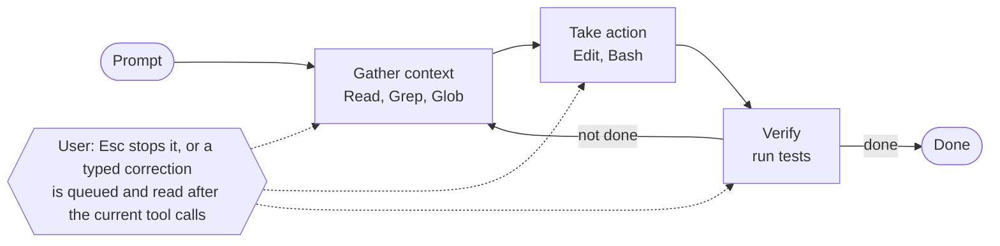

# Claude Code Core Concepts

Claude Code = model (reasons) + tools (act) + the harness around them (supplies tools, manages context). Everything below follows from one fact: **the context window is the budget, and every request re-sends it**. Detail files: [how-claude-code-works.md](how-claude-code-works.md) (loop, access, sessions, permissions, working tips), [extensions.md](extensions.md) (every extension, comparisons, load timing), [context-window.md](context-window.md) (a session token by token, compaction), [directory.md](directory.md) (`.claude/` layout), [caching.md](caching.md) (prompt cache). Source: code.claude.com/docs (`how-claude-code-works`, `features-overview`, `claude-directory`, `context-window`, `prompt-caching`, `memory` for rule `paths:` details).

## 1. Agentic loop



* The loop adapts: a question may only gather; a bug fix cycles all three phases.
* Tool categories: file ops, search, execution (shell, git), web, code intelligence (needs an LSP plugin). Also orchestration tools (subagents, `AskUserQuestion`).
* Each tool result feeds the next decision, so "fix the failing tests" becomes run → read error → search → read → edit → rerun.
* Models: Sonnet for most coding, Opus for hard reasoning. `/model` or `claude --model <name>`.
* Environments: local (default), cloud VMs (Anthropic-managed or self-hosted), Remote Control (browser UI, local execution). Interfaces: terminal, desktop app, IDE, claude.ai/code, Slack, CI/CD. The loop is identical in all of them.
* Access: the project directory (elsewhere with permission), any terminal command you could run, git state (branch, uncommitted changes, recent commits), CLAUDE.md / AGENTS.md, auto memory, configured MCP servers, skills, subagents, Claude in Chrome.
* Steering: `Esc` stops and cancels the running tool call; a message typed while Claude works is queued and read after the current tool calls, within the same turn. Iterate ("that's not it, the issue is in session handling") instead of restarting; delegate with context and a direction, not a file list.

## 2. Sessions, checkpoints, permissions

| Concept | Fact |
|---|---|
| Session storage | JSONL under `~/.claude/projects/` (plaintext; everything a tool touched is in it) |
| New session | Fresh context. Only CLAUDE.md and auto memory carry over |
| `--continue` / `--resume` | Same session ID, appends |
| `--fork-session` / `/branch` | Copies history to a new ID, original untouched |
| Branch switch | Files change, conversation stays |
| Parallel work | Separate directories via git worktrees |
| Checkpoints | Snapshot before each file-tool edit; `Esc Esc` or `/rewind`. Separate from git, survive resume. Cover only file-tool edits (restore skips symlinked and hard-linked files): not Bash side effects, DBs, APIs, deploys. Git is the real safety net |

| Permission mode (`Shift+Tab` cycles) | Without asking |
|---|---|
| Auto | Classifier reviews actions in the background, blocks risky ones. Default for interactive terminal and VS Code from v2.1.283 |
| Manual | Nothing; asks before edits and shell commands |
| Accept edits | File edits and common filesystem commands (`mkdir`, `mv`) |
| Plan | Explores and proposes a plan; no source edits |

Allow trusted commands (`npm test`, `git status`) in `.claude/settings.json`. `/init` writes a starter CLAUDE.md; `/doctor` diagnoses and fixes setup issues.

## 3. Choosing the extension

| Need | Use | Loads | Context cost |
|---|---|---|---|
| "Always do X" facts and rules | `CLAUDE.md` | session start, full | every request |
| Same, but only for some files | `.claude/rules/*.md` with `paths:` | when Claude Reads, Writes or Edits a matching file | after load, in history |
| Response tone, length, role | Output style | session start | every request |
| Knowledge or workflow, sometimes needed | Skill | description at start, body on use | low until used; `disable-model-invocation: true` = zero until `/name` |
| Isolated, read-heavy or parallel work | Subagent | own fresh window | summary only returns |
| Many subagents from a script | Dynamic workflow (`workflows/*.js`) | `/<name>` | one result |
| External service tools | MCP | tool names at start, schemas on demand (tool search) | low until a tool is used |
| Must happen every time, no judgment | Hook | on lifecycle event | zero unless it returns output |
| Same setup in many repos | Plugin (bundles skills, hooks, agents, MCP) | per component | per component |

* Hook vs instruction: "never edit `.env`" in CLAUDE.md is a request. A `PreToolUse` hook that blocks it is enforcement.
* Skill + MCP: MCP gives the tool, the skill teaches how to use it well.
* Triggers to add something: convention wrong twice → CLAUDE.md. Same prompt typed three times → skill. Side task floods output → subagent. Must happen every time → hook.
* Place content by when it's needed, not by its size: needed every session → CLAUDE.md, needed only for some tasks → skill (it loads when it's relevant). A long CLAUDE.md is fine if every line carries value.
* Full comparison tables (skill vs subagent, hook vs skill, …) and the "add X when Y happens" list: [extensions.md](extensions.md).

**Layering when a name exists at several levels:**

| Feature | Rule |
|---|---|
| CLAUDE.md | additive, all levels load; conflicts reconciled by judgment |
| Skills | override by name: managed > user > project |
| Subagents | managed > CLI flag > project > user > plugin |
| MCP servers | local > project > user |
| Hooks | merge, all fire |

## 4. Context window

**Loaded before you type:** system prompt, auto memory (`MEMORY.md`, first 200 lines or 25KB), environment info + git status, MCP tool names, skill descriptions, `~/.claude/CLAUDE.md`, project `CLAUDE.md`, unscoped rules.

**Added as you work:** every file read, command output, search result; path-scoped rules when a matching file is Read, Written or Edited; hook output (`PostToolUse`: only `additionalContext` JSON, plain stdout goes to the debug log; any hook over 10,000 chars → file path + preview); `!command` output; system reminders (file changed on disk, commit attribution). Most of it is invisible in the terminal. `/context` shows the real breakdown; `/context all` adds per-MCP-tool tokens.

**Subagent context:** own system prompt, own copy of CLAUDE.md (Explore and Plan agents skip it), same MCP and skills, task prompt from the parent, no conversation history (a *fork* gets a copy). Reading 6,100 tokens of files returns ~420 tokens to the parent.

**What survives `/compact` (or auto-compact):**

| Content | After compaction |
|---|---|
| System prompt, output style | still applies |
| Project-root CLAUDE.md, unscoped rules, auto memory | re-injected from disk |
| Plan-mode plan | re-injected |
| Rules with `paths:` | gone until a matching file is Read, Written or Edited again |
| Nested CLAUDE.md | gone until a file in that subdirectory is read again |
| Files read or edited | up to 5 re-read, newest first; over 5,000 tokens becomes a path reference |
| Invoked skill bodies | re-injected, 5,000 tokens each, 25,000 total, oldest dropped; truncation keeps the **top** |
| Skill description list | not re-injected; only invoked skills return |
| Context hooks added earlier | summarized away |
| `SessionStart` hooks matching `compact` | run again, output added |
| Background commands and subagents | keep running |

* Consequence: a rule that must persist goes in root CLAUDE.md (not `paths:`), and the most important lines of a skill go at its top.
* Order when full: older tool outputs are cleared first, then the conversation is summarized.
* System reminders: Claude Code itself adds CLAUDE.md, the output style, file-changed-on-disk notes and commit/PR attribution lines. A rule you never wrote (a `Co-Authored-By` trailer) comes from here; change it with the `attribution` setting, drop the built-in git instructions with `includeGitInstructions: false`.
* Early instructions given only in chat get lost. Put persistent rules in CLAUDE.md, or a "Compact Instructions" section there.
* Controls: `/compact focus on X`, `/rewind` → Summarize from/up to here, `/autocompact <tokens>`, `/clear` between unrelated tasks, delegate big reads to a subagent. Repeated refill after each summary triggers a thrashing error and auto-compact stops.
* 1M window: Fable, Sonnet 5+, Opus 4.6+. Sonnet 5.5 has it built in.

## 5. Prompt caching in one screen

* Each request re-sends everything; the API reuses the **exact matching prefix** and bills it at the cached rate. Any change in the prefix recomputes everything after it.
* Order, stable first: system prompt + tool definitions → CLAUDE.md, memory, unscoped rules → conversation.
* Invalidates (one slow, costly turn): switching model, changing effort on older models, first fast-mode turn, adding/removing tool definitions (MCP without tool search, whole-tool deny rule), `/compact`, many images, upgrading Claude Code.
* Keeps the cache: editing repo files, editing CLAUDE.md (but it **doesn't apply** until `/clear`, `/compact` or restart), permission mode, output style, invoking skills, `/rewind`, spawning subagents, `/recap`.
* Habit: pick model and effort at session start; `/compact` at natural breaks between tasks.
* TTL: 5 minutes, or 1 hour for the main conversation on a subscription within plan usage. Set `promptCacheTtl` or `CLAUDE_CODE_PROMPT_CACHE_TTL` (`5m`/`1h`). More in [caching.md](caching.md).

## 6. Where files live

```
your-project/
├── CLAUDE.md                         committed   instructions, loaded every session
├── .mcp.json                         committed   team MCP servers
└── .claude/
    ├── settings.json                 committed   permissions, hooks, env
    ├── settings.local.json           gitignored  personal overrides
    ├── rules/                        committed   path-scoped instructions
    ├── skills/<name>/SKILL.md        committed   on-demand knowledge, /name
    ├── agents/                       committed   subagents
    ├── workflows/                    committed   subagent scripts, /name
    └── output-styles/                committed   tone and format

~/                                               personal, all projects
├── .claude.json                      local       app state, OAuth, personal MCP
└── .claude/
    ├── CLAUDE.md                     local       personal instructions, every project
    ├── settings.json                 local       default settings
    ├── keybindings.json              local       shortcuts, hot-reloaded
    ├── themes/                       local       color themes
    ├── rules/ skills/ agents/        local       same as project, apply everywhere
    ├── workflows/ output-styles/     local
    └── projects/<project>/memory/               auto memory, written by Claude
        ├── MEMORY.md                 local       first 200 lines / 25KB load at start
        └── <topic>.md                local       read on demand
```

Full table with scope, commit status and frontmatter fields: [directory.md](directory.md).
