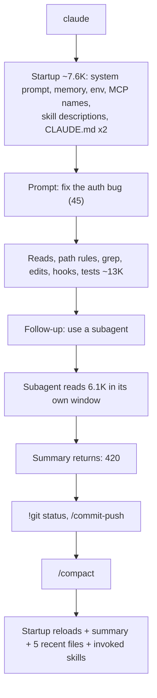

# The context window, step by step

Source: code.claude.com/docs/en/context-window. Token counts are the docs' illustrative numbers against a 200K window; check real ones with `/context`.

## Contents

* One session, start to compact
* What you see vs what Claude sees
* What survives compaction
* When context fills up

## One session, start to compact

**Before you type (all invisible in the terminal):**

| Item | Tokens | Notes |
|---|---|---|
| System prompt | 4,200 | Core behaviour, tools, formatting. Always first |
| Auto memory `MEMORY.md` | 680 | First 200 lines or 25KB |
| Environment info | 280 | cwd, platform, shell, OS, git repo flag; git branch/status/commits as a separate block |
| MCP tools (deferred) | 120 | Names only. `ENABLE_TOOL_SEARCH=auto` loads schemas upfront if they fit in 10% of the window; `=false` loads all |
| Skill descriptions | 450 | One line each. `disable-model-invocation: true` skills absent. **Not re-injected after `/compact`** |
| `~/.claude/CLAUDE.md` | 320 | Global preferences |
| Project `CLAUDE.md` | 1,800 | Keep under 200 lines |

Also possible at startup: AGENTS.md, output style, `--append-system-prompt` text. Your 45-token prompt is tiny next to this.

**As Claude works:**

| Event | Tokens | You see |
|---|---|---|
| Read `src/api/auth.ts` | 2,400 | "Read auth.ts" only |
| Read `src/lib/tokens.ts` | 1,100 | one-liner |
| Rule `api-conventions.md` (`paths: src/api/**`) | 380 | "Loaded .claude/rules/…", not the content |
| Read `middleware.ts`, `auth.test.ts` | 3,400 | one-liners |
| Rule `testing.md` (`*.test.ts`) | 290 | one-liner |
| `grep "refreshToken"` | 600 | that it ran |
| Claude's analysis, edits, summary | ~2,200 | full text and diffs |
| `PostToolUse` prettier hook, per edit | 100–120 | nothing |
| `npm test` output | 1,200 | pass count only |

* File reads dominate. Name the file ("fix the bug in auth.ts") so fewer are read.
* **Hook output:** only `hookSpecificOutput.additionalContext` JSON enters context for `PostToolUse`. Plain stdout on exit 0 goes to the debug log, not Claude. Exit 2 surfaces stderr as an error (cannot block, the tool already ran). Over 10,000 characters → saved to a file; Claude gets the path and a preview.

**Subagent (its own window; only the result costs you):**

| In the subagent | Tokens |
|---|---|
| Own, shorter system prompt (no main auto memory; custom agent with `memory:` loads its own `MEMORY.md`) | 900 |
| Own copy of project CLAUDE.md (Explore and Plan skip it) | 1,800 |
| Same MCP and skills; most parent tools, minus plan-mode, background-task and (by default) Agent tools | 970 |
| Task prompt Claude wrote | 120 |
| Reads `session.ts`, `timeouts.ts`, `config/*.ts` | 6,100 |
| **Returned to your window:** final text + metadata trailer | **420** |

**Your own inputs:**

* `!git status`: the `!` prefix runs a shell command; command and output enter context as part of your message (180). Grounds Claude without Claude running it.
* `/commit-push` with `disable-model-invocation: true`: zero cost until invoked, then full body (620).

## What you see vs what Claude sees

| Visibility | Examples |
|---|---|
| Invisible | System prompt, memory, env, MCP names, skill descriptions, CLAUDE.md, hook output, subagent internals |
| One-liner | File reads, rule loads, grep, test output, subagent notice |
| Full | Your prompts, Claude's text, diffs, `!` command output |

After compaction the terminal shows "Conversation compacted", a "Read" line per re-read file and "Skills restored (…)", none of the content.

## What survives compaction

Startup content lives outside the message history, which is why it reloads; everything in the history is summarized. Summarization inherits the session's extended-thinking setting (v2.1.198+); session settings are unchanged afterwards. Claude can still refer to summarized work but no longer has its exact content. The summary keeps requests and intent, key concepts, files examined or modified with important snippets, errors and fixes, pending tasks, current work. Full tool outputs and intermediate reasoning are gone.

| Mechanism | After compaction |
|---|---|
| System prompt, output style | Still apply |
| Project-root CLAUDE.md, unscoped rules | Re-injected from disk |
| Auto memory | Re-injected from disk |
| Git status snapshot | Fresh one read |
| Plan-mode plan | Re-injected from disk |
| Rules with `paths:` | Reloaded when a matching file is read |
| Nested CLAUDE.md | Reloaded when a file in that subdirectory is read |
| Files read or edited | Up to five re-read, most recently modified first; over 5,000 tokens → `Referenced file` (path only) |
| Invoked skill bodies | 5,000 tokens per skill, 25,000 total, oldest dropped; truncation keeps the start |
| Skill description listing | Not reloaded |
| Background commands and subagents | Keep running; Claude is reminded so it won't duplicate them |
| Context hooks added earlier | Summarized with the rest |
| `SessionStart` hooks matching `compact` | Run, output added |

* A rule that must persist: drop `paths:` or move it into root CLAUDE.md.
* Put a skill's most important instructions at the top of `SKILL.md`.

## When context fills up

Auto-compaction runs as you near the limit (threshold depends on model and config).

| Action | Command |
|---|---|
| Steer what the summary keeps | `/compact focus on the auth bug fix` |
| Summarize only part | `/rewind` → pick a message → **Summarize from here** / **up to here** |
| Compact earlier | `/autocompact 500k` |
| Switch to unrelated work | `/clear` |
| Keep big reads out | Delegate to a subagent |
| Inspect | `/context` (live breakdown, which CLAUDE.md and memory loaded); `/memory` to edit them |

* 1M-token window: Fable models, Sonnet 5+, Opus 4.6+, Sonnet 4.6 (select a `[1m]` variant). Sonnet 5.5 and Sonnet 5 always run 1M, no variant. Compaction works the same at 1M.
* Behind an LLM gateway or custom model ID, Claude Code may assume the wrong window; correct it per the model-config docs.
