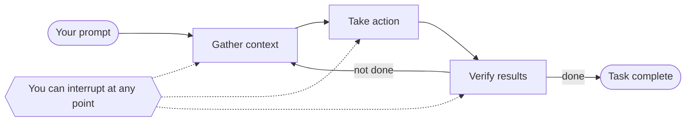

# How Claude Code works

Source: code.claude.com/docs/en/how-claude-code-works. Claude Code is an agentic assistant in the terminal: coding, but also docs, builds, file search, research, anything doable from a command line.

## Contents

* The agentic loop
* Models and tools
* What Claude can access
* Environments and interfaces
* Sessions
* The context window
* Checkpoints and permissions
* Working effectively

## The agentic loop



* Three phases that blend together; tools are used throughout (search to understand, edit to change, run tests to check).
* The loop adapts to the request:

| Request | Phases used |
|---|---|
| Question about the codebase | Gather only |
| Bug fix | All three, repeatedly |
| Refactor | All three, heavy on verification |

* Claude decides each step from what the previous one returned, chaining dozens of actions and course-correcting.
* You are part of the loop: interrupt to steer, add context, or ask for another approach.
* **Agentic harness** = Claude Code itself: the layer around the model that provides the tools and manages the context the model sees. "Claude decides" means the model reasons.

## Models and tools

**Models.** Read code in any language, see how components connect, break complex work into steps and adjust. Sonnet handles most coding; Opus gives stronger reasoning for complex architectural decisions. Switch with `/model`, or start with `claude --model <name>`.

**Tools** make it agentic: without them Claude can only answer in text. Each tool result feeds the next decision.

| Category | What Claude can do |
|---|---|
| File operations | Read, edit, create, rename, reorganize files |
| Search | Find files by pattern, regex content search, explore codebases |
| Execution | Shell commands, start servers, run tests, git |
| Web | Search the web, fetch docs, look up error messages |
| Code intelligence | Type errors and warnings after edits, go to definition, find references (needs a code intelligence plugin) |

Plus orchestration tools: spawning subagents, asking you questions, and more (full list: docs `tools-reference`).

Example, "fix the failing tests":

```
1. run the test suite      → see what fails
2. read the error output
3. search for the source files
4. read them               → understand the code
5. edit                    → fix
6. run the tests again     → verify
```

Extensions sit on top of the loop: skills (what Claude knows), MCP (external services), hooks (automation), subagents (offloaded tasks). See [extensions.md](extensions.md).

## What Claude can access

Running `claude` in a directory gives access to:

| Access | Detail |
|---|---|
| Your project | The directory and subdirectories; files elsewhere with your permission |
| Your terminal | Any command you could run: build tools, git, package managers, utilities, scripts |
| Your git state | Current branch, uncommitted changes, recent commits |
| CLAUDE.md | Project instructions every session; AGENTS.md is read on its own or alongside it |
| Auto memory | Learnings Claude saves itself; first 200 lines or 25KB of `MEMORY.md` at session start |
| Configured extensions | MCP servers, skills, subagents, Claude in Chrome |

Because it sees the whole project, "fix the authentication bug" becomes: search for relevant files → read several → coordinated edits across them → run tests → commit if asked. Inline assistants only see the current file.

## Environments and interfaces

Loop, tools and capabilities are identical everywhere; only where code runs and how you interact change.

| Environment | Code runs on | Use case |
|---|---|---|
| Local | Your machine | Default; full access to your files, tools, environment |
| Cloud | Anthropic-managed VMs, or self-hosted environments your org operates | Offload tasks; repos you don't have locally |
| Remote Control | Your machine, driven from a browser | Web UI while files and execution stay local |

Interfaces: terminal, desktop app, IDE extensions, claude.ai/code, Remote Control, Slack, CI/CD pipelines.

## Sessions

* Every message, tool use and result is written to a plaintext JSONL file under `~/.claude/projects/`. This enables rewind, resume and fork. Before code changes, affected files are snapshotted.
* **Sessions are independent**: each starts with a fresh context window and no prior conversation. Learnings persist only through auto memory and CLAUDE.md.

| Action | Effect |
|---|---|
| `claude --continue` / `--resume` | Reopens the same session ID, appends new messages |
| `--fork-session` / `/branch` | Copies history into a new session ID; original unchanged |
| `/resume` picker | Shows sessions from the current worktree; shortcuts widen to other worktrees or projects |
| Switching git branch | Claude sees the new branch's files; conversation history stays |
| Parallel sessions | Sessions are tied to directories, so use git worktrees (one directory per branch) |

## The context window

Holds conversation history, file contents, command outputs, CLAUDE.md, auto memory, loaded skills, system instructions. It fills as you work. `/context` shows what uses space. Full walkthrough: [context-window.md](context-window.md).

**Context Claude Code adds on its own** (system reminders, next to your messages). A rule you didn't write, like a `Co-Authored-By` commit trailer, usually comes from here:

| Added | Control |
|---|---|
| Your CLAUDE.md files | edit them |
| Active output style instructions | switch style |
| A note when a file Claude read earlier changes on disk | none |
| Commit and PR attribution lines | `attribution` setting; `includeGitInstructions: false` removes the built-in git instructions |

**When context fills up:**

```
1. clear older tool outputs
2. if still needed, summarize the conversation
   kept:  your requests, key code snippets
   lost:  detailed instructions from early in the conversation
```

* Persistent rules belong in CLAUDE.md, not in chat history.
* Steer compaction with a "Compact Instructions" section in CLAUDE.md, or `/compact focus on the API changes`.
* If one file or tool output refills context right after each summary, auto-compaction stops after a few attempts with a thrashing error instead of looping.
* MCP tool definitions are deferred (tool search): only names and server instructions cost context until a tool is used.

**Skills and subagents also control context:**

* Skills: descriptions at start, body on use. `disable-model-invocation: true` keeps a manual-only skill's description out; `skillOverrides` in settings does the same for skills you didn't write.
* Subagents: own context window, fresh unless it's a fork (copy of the conversation so far). Their tool calls stay out of yours; you get a summary.

## Checkpoints and permissions

**Checkpoints: file edits are reversible.**

* Before each edit Claude snapshots the file. `Esc` twice rewinds, or ask Claude to undo.
* Separate from git; survive resuming a conversation.
* Cover file changes only. A restore skips symlinked and hard-linked files.
* Remote effects (databases, APIs, deployments) can't be checkpointed; control them with permission mode and rules.

**Permission modes** (`Shift+Tab` cycles):

| Mode | Claude does without asking |
|---|---|
| Auto | A background classifier reviews most actions and blocks risky ones instead of asking. Default starting mode for interactive terminal and VS Code from v2.1.283; earlier versions only on Pro, Max, Team |
| Manual | Nothing: asks before file edits and shell commands |
| Accept edits | Edits files and common filesystem commands (`mkdir`, `mv`); asks for other commands |
| Plan | Explores and proposes a plan; doesn't edit source files |

Allow trusted commands (`npm test`, `git status`) in `.claude/settings.json` so Claude stops asking. Settings scope from organization policy down to personal preferences.

## Working effectively

* **Ask Claude Code about itself**: "how do I set up hooks?", "how should I structure CLAUDE.md?". `/init` generates a starter CLAUDE.md; `/doctor` diagnoses and can fix installation and configuration issues.
* **It's a conversation**: start with what you want, then refine instead of starting over.

```
you:    Fix the login bug
claude: [investigates, tries something]
you:    That's not quite right. The issue is in the session handling.
claude: [adjusts]
```

* **Interrupt and steer**:

| Action | Effect |
|---|---|
| `Esc` | Stops immediately; the running tool call is canceled; queued messages are sent next |
| Type a correction + `Enter` while it works | Queued; read as soon as the current tool calls finish, within the same turn, before the next step |

* **Delegate, don't dictate**: give context and direction like to a capable colleague; Claude picks the files and commands.

```
The checkout flow is broken for users with expired cards.
The relevant code is in src/payments/. Can you investigate and fix it?
```
