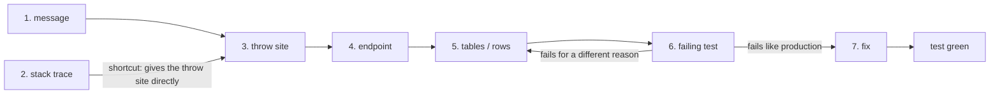

# debug-exception

Goal: evidence → source line → endpoint → data → red xUnit test. Fix only after the test is red.



Input: $ARGUMENTS

## 1. Exception message

* Copy the message verbatim; split it into the **literal** part and the **interpolated** part.
   * `Loan 4821 has no active repayment plan` → literal `has no active repayment plan`, value `4821`.
   * Search with the literal part only; the value is your data lead for step 5.
* Note the exception type: own domain exception vs framework (`DbUpdateException`, `NullReferenceException`, `InvalidOperationException: Sequence contains no elements`).
   * Framework exceptions have no searchable message in our code → you need the stack trace.

## 2. Stack trace

* Have one? Take the **first frame in our code** (`FF.*`, `Ftb.*`), not the top frame.
* Async frames: `<ApproveLoan>d__12.MoveNext()` → method `ApproveLoan`. Never search for `MoveNext`.
* No stack trace → ask for it (App Insights: exception → *details*, or the `operation_Id` to pull correlated traces). Continue with step 3 meanwhile.

## 3. Where the exception is generated

```bash
grep -rn "has no active repayment plan" API/ --include=*.cs
```

* One hit → read the whole method and its callers, not only the `throw` line.
* No hit:
   * The message is built in pieces (`$"{x} has no..."`, resource string, `string.Format`) → search shorter fragments.
   * It comes from a library/EF → use the stack trace frame instead.
* Several hits → the stack trace or endpoint (step 4) picks the right one.

## 4. Endpoint that triggers it

Most endpoints are GraphQL (Hot Chocolate) mutations, of two kinds:

| Kind | Where the code is | How to find it |
|---|---|---|
| Hand-written | `FF.Api/Mutations/**/*Mutation.cs` | grep the field name |
| **Source-generated** from a command | `FF.Api/obj/GeneratedFiles/Ftb.SourceGenerators/Ftb.SourceGenerators.FtbProjectSourceGenerator/<Name>Mutation.g.cs` | **not in source** — go via the command |

* Source-generated mutations don't exist in `FF.Api` source; grep finds nothing.
   * ✗ `grep -rn "anonymizeAndDeletePerson" FF.Api --include=*.cs` → only `/obj/` or nothing.
   * ✓ Start from the command (handler) and follow its references:
      ```
      FF.App/Accounts/Commands/AnonymizeAndDeletePersonCommand.cs   (CommandBase<Input, Output, FFCoreUnitOfWork>)
        └─ Find Usages / grep the class name in obj/GeneratedFiles
           └─ AnonymizeAndDeletePersonMutation.g.cs
              └─ GraphQL field: anonymizeAndDeletePerson(input: AnonymizeAndDeletePersonInput)
      ```
   * Naming rule: `<Name>Command` → `<Name>Mutation.g.cs` → field `<name>` (camelCase).
   * Generated files only exist after a build: `dotnet build FF-Api.sln` (from `API/FF-API/`).
* The generated wrapper adds behavior that can explain the bug:
   * `ConcurrentUpdateRetryPolicy` → the command can run **more than once** per request.
   * `DbUpdateException` (non-concurrency) that `ParseDbUpdateException()` recognizes becomes an output error; an unrecognized one is rethrown.
   * Output `IsSuccess == false` → `uow.Rollback()`; nothing is persisted.
* Not a mutation? Check queries (`FF.Api/FFApiQuery.cs`), REST controllers (external API and webhooks such as AIIA, Stripe, KYC in `FF.Api/Controllers/**`; feature modules in `FF.Api/Features/<Name>Feature/API/REST/`), handlers/processors (`LoanRepaymentProcessor`, `*Handler` for domain events), scheduled jobs. Stack trace frames name the entry point.

## 5. Database: which tables, which rows

* List the entities the failing method reads or writes (`uow.Loans`, `dbContext.Set<Loan>()`, navigation properties).
* Entity → table name: `FF.Core/Migrations/FFCoreDbContextModelSnapshot.cs`, search `b.ToTable("...")` under the entity.
* Query the rows behind the interpolated value from step 1:
   ```bash
   sqlcmd -S <server> -d <database> -Q "SELECT Id, Status, ... FROM Loans WHERE Id = 4821"
   ```
   * **Read-only `SELECT` only.** Never `UPDATE`/`DELETE`/`INSERT`, even to "fix the data".
   * Ask the user which database (local / test / staging / prod) and for the connection; don't guess one.
   * Don't paste personal data (names, CPR, emails, account numbers) into the reply; report the shape (`Status = Funded, RepaymentPlanId = NULL`).
* Goal of the query: the exact state that breaks the invariant. That state is the test's Arrange.

## 6. Reproduce with an xUnit test

The test documents the bug and proves the fix. Write it with the `tests-as-documentation` skill.

* Arrange the state found in step 5 → Act on the endpoint's command/handler → Assert the **correct** behavior, as specifically as it can be stated.
   * ✗ `Assert.Throws<InvalidOperationException>(...)` — asserts the bug; it passes until someone fixes it.
   * ✗ `output.IsSuccess.Should().BeFalse()` — `IsSuccess` is just `Errors.Count == 0`, so *any* error passes it: a wrong Arrange, an unrelated validation error, missing seed data. The test goes green in CI without proving the fix.
   * ✓ Assert the exact outcome the fix produces:
      ```csharp
      // fix = reject with a clear error
      output.Errors.Should().ContainSingle().Which.Message.Should().Be("Loan has no active repayment plan")
      // fix = the operation succeeds
      output.IsSuccess.Should().BeTrue()
      loan.Status.Should().Be(LoanStatus.Funded)
      ```
* Red → green happens locally. Commit the test together with the fix, so CI never sees the red test.
* Pick the database by what the bug needs:

| Bug needs | Use |
|---|---|
| Any database behavior (the legacy SQLite `InMemDbFixture` hides SQL Server's constraints, collation and concurrency) | Testcontainers: `[Collection(nameof(MsSqlCollection))]` + `MsSqlContainerFixture` (`FF.Tests/Util/MsSqlContainerFixture.cs`, example `FF.Tests/AutoInvest/AutoInvestProcessorTests.cs`) |
| Other external dependency (Redis, …) | A Testcontainers module for it, same fixture pattern |

* Run it and confirm it fails **for the same reason** as production (same message/type):
   ```bash
   # from API/FF-API/
   dotnet test FF.Tests/FF.Tests.csproj --filter "FullyQualifiedName~<TestClass>"
   ```
   * Fails for a different reason → the Arrange doesn't match production state; go back to step 5.

## 7. Report, then fix

Before changing production code, state:

* Root cause in one sentence + confidence (high/medium/low).
* Evidence: throw site `file:line`, endpoint, offending row state, red test name.
* Proposed fix and what else it changes.

Then make the smallest fix that corrects the invalid state or logic (not one that only stops the throw), and run the test → green.
