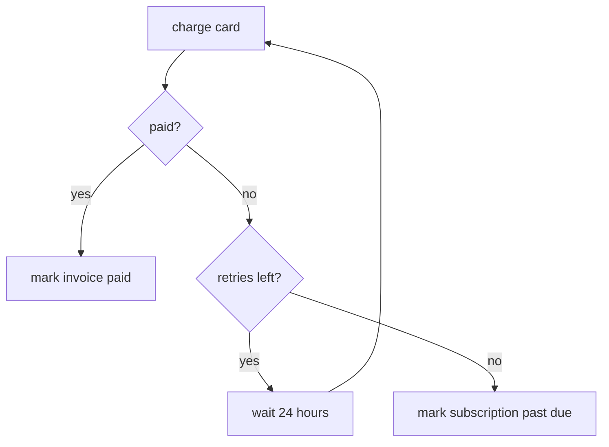
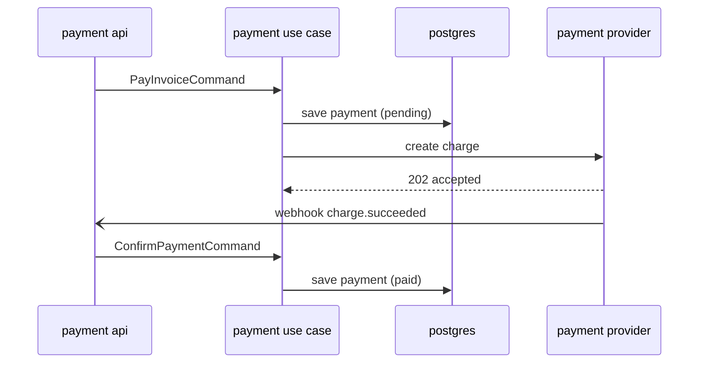
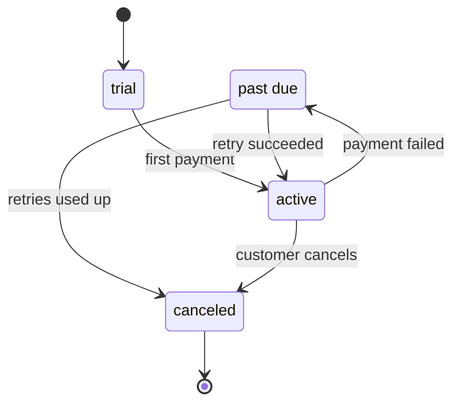
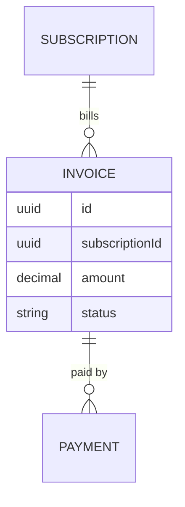
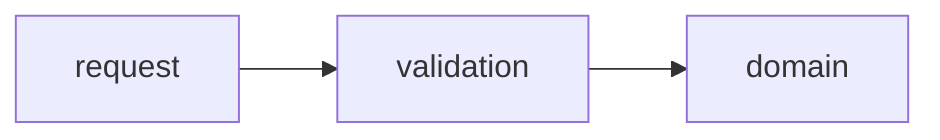

# High-Quality Tokens / High-Quality Density: Examples

## Contents

1. Full rewrite: SOLID
2. Visual forms
3. Mermaid diagrams
4. House style for notes and rules

## 1. Full rewrite: SOLID

This is the target column from the [SKILL.md](SKILL.md#two-failure-modes) table. Each principle gets one rule, one why, and a ✗/✓ example.

---

SOLID: five rules for code that changes by adding classes, not by rewriting classes that work.

### S, Single Responsibility

* A class has one reason to change.
* Why: a change to email can't break saving users.

```csharp
// ✗ storage and email change for different reasons
class UserService
{
    public void Save(User user) { ... }
    public void SendWelcomeEmail(User user) { ... }
}

// ✓ one reason each
class UserRepository { public void Save(User user) { ... } }
class EmailService   { public void SendWelcomeEmail(User user) { ... } }
```

### O, Open/Closed

* Add behavior with a new class, not by editing a working one.
* Why: tested code stays untouched.

```csharp
// ✗ every new payment method edits this switch
switch (method) { case "card": ...; case "paypal": ...; }

// ✓ a new method is a new class; PaymentService is unchanged
interface IPaymentProcessor { void Pay(decimal amount); }
class CryptoPayment : IPaymentProcessor { public void Pay(decimal amount) { ... } }
```

### L, Liskov Substitution

* A subtype must work everywhere its base type does.
* Why: callers trust the base type's promise. A subtype that breaks the promise breaks every caller.

```csharp
// ✗ Bird promises Fly(); Penguin can't keep it
abstract class Bird { public abstract void Fly(); }
class Penguin : Bird { public override void Fly() => throw new System.NotSupportedException(); }

// ✓ the base type promises only what every subtype can do
abstract class Bird { public abstract void Move(); }
```

### I, Interface Segregation

* A client depends only on the methods it calls.
* Why: no class implements a method it can't do, and no client breaks when a method it doesn't use changes.

```csharp
// ✗ SimplePrinter must implement Scan, which it can't do
interface IMachine { void Print(string content); void Scan(string document); }

// ✓ split by what clients use
interface IPrinter { void Print(string content); }
interface IScanner { void Scan(string document); }
class SimplePrinter   : IPrinter           { ... }
class AllInOnePrinter : IPrinter, IScanner { ... }
```

### D, Dependency Inversion

* High-level code depends on an abstraction, and the details implement it.
* Why: swap the detail (file → console → test fake) without touching `OrderService`.

```
OrderService ──→ ILogger ←── ConsoleLogger
                         ←── FileLogger
```

```csharp
class OrderService(ILogger logger) { ... }              // doesn't know which logger it gets
var orderService = new OrderService(new FileLogger()); // chosen where the app is wired up
```

---

## 2. Visual forms

Pick the form that matches the shape of the idea.

| Shape of the idea | Form |
|---|---|
| Hierarchy, layers, ownership | Tree |
| Steps, data moving between nodes | Flow |
| Items compared on the same attributes | Table |
| A rule applied, a change | Before → after (✗/✓) |
| A transformation | Input → output |
| Behavior in code | Smallest snippet |
| Loops, participants, states, entity relations | Mermaid ([section 3](#3-mermaid-diagrams)) |

**Tree**

```
features/billing/
├── invoicing/      creates invoices
├── payment/        charges cards
└── subscription/   renews plans
```

**Flow**

```
request → DTO validation ─✗→ 400 (the domain never sees it)
                         ─✓→ use case → domain → postgres → event
```

**Table**

| Storage | Lifetime | Example |
|---|---|---|
| Cache | Short | Redis |
| RAM | Medium | process state |
| Storage | Long | files, blobs |
| Database | Indexed | Postgres |

**Before → after**

```
✗ It's important to note that, in order to avoid issues, you should basically validate input early.
✓ Validate input in the DTO, before it reaches the domain.
```

**Input → output**

```
"2026-10-02T14:00+02:00"  → normalize to UTC →  2026-10-02T12:00Z
```

**Smallest snippet**

```csharp
if (amount <= 0) return false; // fail early: the domain never sees an invalid amount
```

## 3. Mermaid diagrams

The source goes in a ` ```mermaid ` block. GitHub, GitLab, Obsidian and Notion render it as a picture, and a terminal shows the source. The examples reuse the billing feature.

| Shape of the idea | Mermaid type |
|---|---|
| Steps with branches and loops | `flowchart` |
| Messages between participants over time | `sequenceDiagram` |
| States and the events that move between them | `stateDiagram-v2` |
| Entities and their cardinality | `erDiagram` |

**flowchart**: payment retry. ASCII draws the loop back to `charge` badly.



**sequenceDiagram**: paying an invoice. `-)` is an async message: the provider answers later, through a webhook.



**stateDiagram-v2**: subscription lifecycle. `state "past due" as pastDue` gives a label with spaces an ID.



**erDiagram**: billing data. `||--o{` reads "exactly one to zero or more".



**When ASCII wins**

A straight line takes three lines of Mermaid source plus a renderer to say what ASCII says in one line.

✗



✓

```
request → validation → domain
```

**Writing it** (checked against Mermaid 11)

* IDs are full camelCase names, so the raw source reads as clearly as the picture.

```
✗ C -- no --> D{E?}
✓ paid -- no --> retriesLeft{retries left?}
```

* Quote a label that contains parentheses.

```
✗ dto[DTO (request / command)] --> domain      Parse error: ... got 'PS'
✓ dto["DTO (request / command)"] --> domain
```

* A lowercase `end` node breaks a flowchart, because `end` is a keyword.

```
✗ start --> end
✓ start --> done
```

* Render the diagram before committing it. GitHub shows a syntax error in place of the diagram. Either paste it into https://mermaid.live or run:

```bash
npx -p @mermaid-js/mermaid-cli mmdc -i diagram.mmd -o diagram.svg   # fails on a syntax error
```

## 4. House style for notes and rules

Nested bullets, one idea per line, fragments, no prose intros. Each parent is an idea and its children refine it.

```markdown
* KISS
* what feature do we want
* what is the data
   * what data views do we need to support
* what is the flow
* what are the inputs, outputs and side effects of the flow
* what is the simplest functional form of the logic we want to implement
   * from there we can worry about objects and organisation
* start by writing it in one file, break it apart after
* less code is better
   * does not mean more compact code that is hard to read
   * code not written is less to debug
* go back to the basics
   * return the object type we create
   * use Booleans
   * fail early
      * DTO (request / command)
   * no exceptions in the domain
   * the domain controls what is valid
* use tests to replicate bugs
* the work saved is time gained
* data layout
* how do we want to process / transform the data
   * do we want to keep the original form?
   * do we want to keep the in-between?
* should we include metadata
* in any system, layers are the foundation for complex systems
   * a node within a graph can be a graph
   * a node within a graph can be a tree
   * an image is layers of color
   * audio is layers of sounds

Data State
* In process
* Persistence
* Cache
* Events

Base Computer Science Rules
* Speed vs Simplicity
* Speed vs Memory vs Accuracy
* Lossless vs Lossy
* Compression vs Time

* Storing Data
   * Short: Cache
   * Medium: RAM
   * Long: Storage (different formats)
   * Indexed: Database
* Scheduling & Synchronization
   * every program/system can be viewed as a network of nodes
      * latency
      * time of transfer
   * the scale does not matter
      * CPU, memory and GPU communicating together
      * communication of processes
      * application communication
      * the World Wide Web
   * data doesn't just move; it waits to move, and that waiting is 90% of what software engineering actually manages
* actual data instead of guesses
   * use CLI tools to gather data
   * use debuggers to track bugs
```
