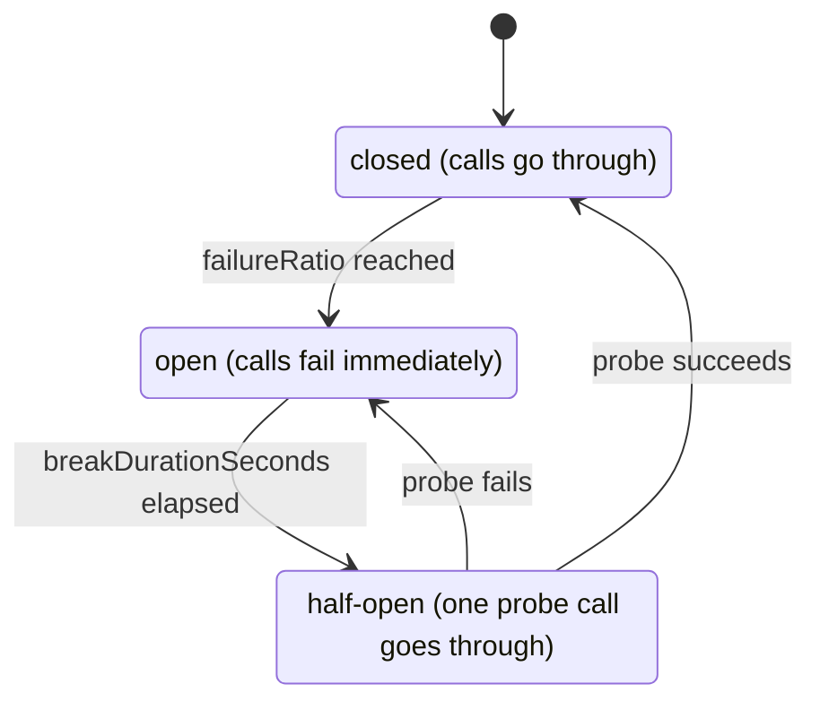
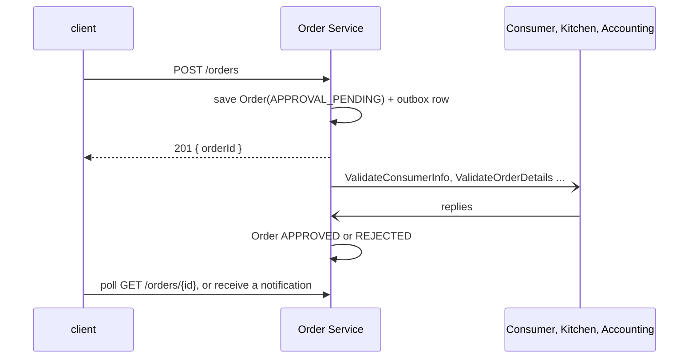

# Decomposition and Communication

Book chapters 1–3 and 8. Running example: FTGO's `createOrder()`.

## Contents

1. Decomposition
2. Interaction styles and API design
3. Synchronous calls
4. Messaging
5. Availability: keep sync calls out of the request path
6. External API: gateway and BFF

## 1. Decomposition

* A service is an independently deployable component with an API of commands, queries and events. Its data is private, like a class's fields: no other service reads its tables.
* Two decomposition patterns, with similar results:
   * **By business capability:** what the business does. It stays stable while *how* it's done changes: "deposit check" went from teller to ATM to phone.
   * **By subdomain (DDD):** each subdomain gets its own domain model. Its scope, the bounded context, is one service or a few.
* Map the capability tree to services. Which level becomes a service is a judgment call:

```
Capability                               Service              Why
Supplier management
├── Courier management                →  Courier Service      couriers and restaurants are
└── Restaurant information management →  Restaurant Service   very different suppliers
Consumer management                   →  Consumer Service
Order taking and fulfillment
├── Order management                  →  Order Service        one service per phase
├── Restaurant order management       →  Kitchen Service
└── Logistics (availability, delivery)→  Delivery Service     deeply intertwined, so merged
Accounting (consumer, restaurant, courier) → Accounting Service   similar enough for now
```

* Two guidelines from OO design:
   * SRP: one responsibility per service. Order taking, preparation and delivery are separate services.
   * Common Closure Principle: things that change for the same reason go in the same service, so a requirement change touches one team and one service. This is what prevents a distributed monolith.
* Shared libraries are fine for code that rarely changes (`Money`). They're wrong for business objects that change: an `Order` library forces every service that uses it to redeploy together.
* Teams: 8–12 people each, owning one or more services. Shape the organization like the architecture (inverse Conway maneuver), because a system ends up mirroring the communication structure of the teams that build it.

**Obstacles and fixes**

| Obstacle | Fix |
|---|---|
| Too many round-trips between two services | A batch API, or merge the services |
| Sync calls reduce availability | Async messaging, replicated data (§5) |
| Data must update atomically | Keep it in one service; otherwise a saga (eventually consistent) |
| A consistent view across data is needed | Keep it in one service (rarely needed in practice) |
| A god class used by every part of the system | One model per bounded context (below) |

**Splitting a god class**

```
✗ one Order: status, total, deliveryTime, pickupTime, transactionId
             create/cancel, accept/reject/noteReadyForPickup, assignCourier/notePickedUp/noteDelivered
✓ Order Service:    Order    (status, total, line items, payment info, delivery info)
  Kitchen Service:  Ticket   (status, requestedDeliveryTime, prepareByTime, line items)
  Delivery Service: Delivery (pickup and delivery location, scheduled times, courier)
  sagas keep them consistent; the API gateway combines them for the UI
```

* Two alternatives look easier and fail:
   * An `Order` library plus a shared database: every schema change ships in lockstep.
   * An "Order data service": an anemic model, with all the logic living somewhere else.

**Defining service APIs**

* Give each system operation an entry service. When ownership is unclear, prefer the service that needs the information: `noteUpdatedLocation()` goes to Delivery, not Courier.
* Then list the collaborators each operation needs:

| Service | Operation | Collaborators it needs |
|---|---|---|
| Order | `createOrder()` | Consumer `verifyConsumerDetails()`, Restaurant `verifyOrderDetails()`, Kitchen `createTicket()`, Accounting `authorizeCard()` |
| Kitchen | `acceptOrder()` | Delivery `scheduleDelivery()` |
| Delivery | `noteUpdatedLocation()`, `noteDeliveryPickedUp()` | none |

## 2. Interaction styles and API design

| | One-to-one | One-to-many |
|---|---|---|
| Sync | Request/response | none |
| Async | Async request/response, one-way notification | Publish/subscribe, publish/async responses |

* The style doesn't depend on the technology. Request/response over a broker is still tightly coupled if the caller blocks until the reply arrives.
* **API-first.** There's no compiler between services, so a mismatch fails at runtime. Write the definition first (OpenAPI or protobuf; for messaging, the channel names, message types and formats), review it with the client developers, then implement.
* **Evolving an API (semver):**
   * Minor, backward compatible, additive: optional request fields, extra response fields, new operations. Follow the robustness principle: services default missing fields, and clients ignore fields they don't know.
   * Major, breaking: serve both versions until every client has moved (`/v1/...` and `/v2/...`, or `Accept: application/vnd.example+json; version=1`). The adapters translate between versions.
* **Message format:** always cross-language.
   * Text (JSON, validated by JSON Schema) is self-describing and easy to evolve.
   * Binary is compact and forces API-first. Protobuf's tagged fields evolve more easily than Avro's.
* **REST:**
   * Resources plus HTTP verbs.
   * Fetching related resources is hard: use `?expand=consumer`, or GraphQL.
   * Several kinds of update don't map onto PUT: use sub-resources (`POST /orders/{id}/cancel`, `POST /orders/{id}/revise`).
* **gRPC:** rich operation sets and streaming, over HTTP/2. Harder for browser clients and old firewalls.

## 3. Synchronous calls

* Partial failure: a slow service ties up the caller's threads, then the caller's callers, until the whole API is down.
* Every proxy that calls another service gets three guards. Their values live in config:

```json
// appsettings.json section: defaults, overridden per environment
{
  "kitchenServiceClient": {
    "timeoutMilliseconds": 2000,                  // never wait forever
    "maxConcurrentRequests": 50,                  // beyond this, fail fast
    "circuitBreaker": {
      "failureRatio": 0.5,                        // trip when half the calls fail
      "breakDurationSeconds": 30                  // then fail immediately until a probe succeeds
    }
  }
}
```



* Then decide recovery per call, based on how much the caller needs the data:

```
GET /orders/{id} (API composition)
Order Service     unavailable → error, or a cached copy   (essential)
Delivery Service  unavailable → cached copy, or omit it   (the UI is still useful)
```

* Service discovery: use the platform's (server-side discovery plus third-party registration, such as Kubernetes Services). Client-side discovery with self-registration is only worth it when services span several platforms.

## 4. Messaging

* A message is a header (id, optional return address) plus a body. There are three kinds: **document**, **command** (an RPC request) and **event** (something happened, usually a domain event).
* There are two kinds of channel:
   * Point-to-point delivers each message to exactly one consumer. Commands use it.
   * Publish-subscribe delivers to every subscriber. Events use it, on a channel named after the aggregate (`Order`).
* Async request/response puts a `MessageId` and a `ReplyChannel` on the request. The reply carries `CorrelationId = MessageId`.
* **Broker vs brokerless:** use a broker. It buffers messages while the consumer is down, and senders don't need to know where consumers are. Brokerless messaging needs both sides up and needs discovery, the same weaknesses as REST.
* Choosing a broker: ordering, delivery guarantees, persistence, durability across reconnects, scalability, latency, competing consumers. Different parts of one system may need different trade-offs. The comparison table is in `system-integration` (messaging.md §4).

**Ordering while scaling out:** a sharded channel. The shard key is the aggregate id, and each shard has exactly one consumer instance (a Kafka consumer group).

```
OrderCreated(order 101)    ─┐  shard = hash(orderId) % N    shard 0 → instance A: every order-101 event, in order
OrderCancelled(order 101)  ─┘                               shard 1 → instance B
```

**Duplicates:** brokers deliver at least once. If a consumer commits to its DB and crashes before acknowledging, the message is redelivered.

* Idempotent logic is enough when the broker keeps order on redelivery: cancelling an already-cancelled order, or creating an order with a client-supplied id.
* Otherwise, record the ids of processed messages in the same transaction as the business update:

```sql
BEGIN;
INSERT INTO processed_messages (consumer_id, message_id)
VALUES ('accounting', 'msg-xyz');            -- primary key: fails on a duplicate, so skip the message
UPDATE credit_card_authorizations SET state = 'AUTHORIZED' WHERE order_id = 101;
COMMIT;
```

* With a NoSQL store that can't update two records atomically, store the message id on the updated record itself.

**Transactional outbox:** write the business change and the message in one local transaction. A relay publishes later.

```sql
-- ✗ save(order); broker.Publish(OrderCreated)
--   a crash in between loses the event, or publishes one for a rolled-back order

-- ✓
BEGIN;
INSERT INTO orders (id, state, consumer_id) VALUES (101, 'APPROVAL_PENDING', 7);
INSERT INTO outbox (destination, payload)   VALUES ('Order', '{"type":"OrderCreated","orderId":101}');
COMMIT;
-- relay: SELECT * FROM outbox ORDER BY id → publish → DELETE the published rows
```

* Relay options:
   * Polling publisher: simple, fine at low scale, but polling costs load.
   * Transaction log tailing: reads the database log (Postgres WAL, MySQL binlog, SQL Server CDC) with Debezium. Scales, but takes more setup.
* 2PC/XA is not the answer. Kafka, RabbitMQ and most NoSQL stores don't support it, and it needs every participant up at once.

## 5. Availability: keep sync calls out of the request path

* An operation's availability is the product of its participants' availability. Three services at 99.5% give 99.5%³ ≈ 98.5%. This also holds for request/response over messaging if the caller waits.
* Options, best first:
   1. **Async end to end.** The client sends a request message and gets a reply message. Rarely possible for public APIs.
   2. **Replicate the data you need from events.** Order Service keeps restaurant menus up to date from `RestaurantMenuRevised`.
      * This doesn't work for huge data sets (every consumer), and it doesn't help when you must update another service's data.
   3. **Validate locally, save with an outbox row, reply, finish asynchronously:**



* The price of option 3: the client must handle an order that isn't decided yet. It usually pays off, because the saga is needed for consistency anyway.

## 6. External API: gateway and BFF

* When clients call services directly:
   * Mobile and browser clients make many round-trips over slow networks.
   * Clients are coupled to the decomposition, so services can't be split or merged freely.
   * Internal protocols (gRPC, messaging) leak to clients.
   * Server-side web apps inside the LAN can still call services directly.
* **API gateway:** the single entry point, a facade over the services. Its responsibilities:
   * Routing: method + path → service. The method matters once CQRS query services exist.
   * API composition: `getOrderDetails` calls Order, Kitchen, Delivery and Accounting in parallel.
   * Protocol translation: REST and WebSocket outside, gRPC or messaging inside.
   * Edge functions: authentication, coarse authorization (role per path), rate limiting, caching, usage metrics, request logging.
   * One API per client type, not one size fits all.
* **Structure:**
   * An API layer with one module per client (mobile, browser, public), plus a common layer for edge functions.
   * Client teams own their module. The gateway team owns the common layer and operations.
   * The deployment pipeline must be fully automated, or the gateway becomes a queue.
* **Backends for frontends:** one gateway per client type, owned by that client team.
   * Gains: clear ownership, isolation (one misbehaving API can't take down the others), independent scaling.
   * Share the common layer as a library.
* **Design rules:**
   * Compose in parallel: sequential calls cost the sum of the latencies.
   * Put a circuit breaker on every downstream call (§3).
   * Implement discovery and observability like any other service.

```csharp
// ✗ 4 sequential awaits: latency = sum
// ✓ independent calls in parallel: latency ≈ the slowest call
var orderTask    = orderServiceProxy.FindOrder(orderId);
var ticketTask   = kitchenServiceProxy.FindTicketByOrderId(orderId);
var deliveryTask = deliveryServiceProxy.FindDeliveryByOrderId(orderId);
var billTask     = accountingServiceProxy.FindBillByOrderId(orderId);
await System.Threading.Tasks.Task.WhenAll(orderTask, ticketTask, deliveryTask, billTask);
```

* Off-the-shelf gateways (AWS API Gateway, Kong, Traefik) route and authenticate, but don't compose. Composition needs your own gateway (YARP or a web framework) or a dedicated composer service.
* A public API for third parties must stay stable for years. Give it to a separate team, as its own module or BFF.
