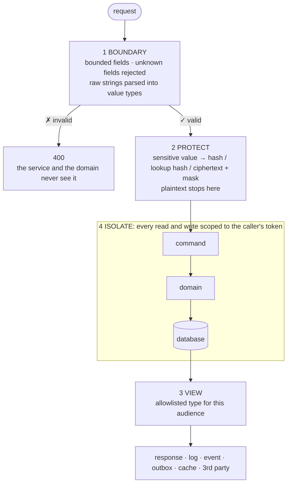

# Security

Every value passes four stages. Each stage has one rule, and every rule holds for the whole task. Rule 5 guards what is already stored.



| # | Rule | ✗ | ✓ |
|---|---|---|---|
| 1 | Nothing invalid gets past the DTO/controller | `string FinancialDataJson` with no length limit, checked inside the service | `[MaxLength]` on the DTO, parsed in the controller, 400 before the service is called |
| 2 | Sensitive data is protected the moment it enters | `person.Cpr = request.Cpr`: plaintext reaches the command, events, logs and cache keys | controller: `ProtectedValue cpr = _sensitiveDataProtector.Protect(...)`; only ciphertext, lookup hash and mask move on |
| 3 | Every output is an allowlist | `return Ok(invoice)`: each new column becomes a new field | `InvoiceResponse` lists the fields this audience may see |
| 4 | Every row access is scoped to the caller, taken from the token | `request.CustomerId` | `_callerContextAccessor.CallerContext.CustomerId` inside the `.Where`; 404 when the row isn't theirs |
| 5 | Readers can't write; facts can't change | a `ReadOnly` role passes the shared back-office policy that also guards `DELETE /ledger-entries/{id}` | write policies list writer roles only; a fact entity has no setters and no update/delete path, a correction is a new row |

* Fail closed: a missing context, role or rule means deny.
   * ✗ An authorization check returns `true` when there is no caller context.
   * ✓ A query filter returns `query.Where(x => false)` when an entity has no owner or partner rule.

## Scope: new code meets the standard, legacy gaps get flagged

* Code you add meets every rule, even inside a legacy file.
* Gaps you pass by in existing code: don't fix them silently. Name them in the reply:

```
Security gap (security skill): InvoicesController is [AllowAnonymous]; create and status changes are unauthenticated.
Not changed here; fixing it is a separate change.
```

## Framework traps (ASP.NET Core + Hot Chocolate)

These look safe but aren't.

| Looks like | Actually | Do |
|---|---|---|
| No attribute means authenticated users only | Without a `FallbackPolicy`, an endpoint with no attribute allows everyone | Set `FallbackPolicy` to require an authenticated user in `src/program.cs`; every controller and resolver still names a policy. `[AllowAnonymous]` carries a comment saying why |
| `[Authorize]` on an action secures it | A class-level `[AllowAnonymous]` overrides every `[Authorize]` beneath it | Never add a secured action to an `[AllowAnonymous]` controller; put it in a new controller |
| `.Authorize()` on a GraphQL field hides it | The field stays in the `where:` and `order:` inputs, which makes a filter oracle: `people(where: { nationalIdentificationNumber: { startsWith: "0101" } })` reveals values through the row count | Hide it in the filter and sort inputs too (§3) |
| An implicitly bound `ObjectType<T>` shows only what you meant | Every public property becomes an output field, and `[UseFiltering]` / `[UseSorting]` make each one a filter and sort input | Bind explicitly (`BindFieldsExplicitly()`) or ignore sensitive fields in all three places (§3) |
| A `ReadOnly` / `Viewer` role can't write | It passes any shared policy that also admits it (a generic back-office or CRUD policy) | Write policies list writer roles only (rule 5) |
| Mapping a request onto an entity is safe | A mapper that copies every input field onto public setters (AutoMapper, a reflection copier) lets the caller set server-owned fields (`Status`, owner ids, MFA data) | New inputs list only the fields the caller may choose; map by hand |

## 1. Boundary: fail fast

* Validate in the request DTO and the controller, before any service call.
   * REST: `[ApiController]` returns 400 when DataAnnotations fail, so the action never runs.
   * GraphQL mutation: validate the input type in the resolver (or an input-validation middleware) before calling `application/`.
* Bound every field: required, type, length, range, format, enum, list count.
   * `[Required]` on a non-nullable `int` passes for `0`. Use `[Range(1, int.MaxValue)]`.
   * Every string gets `[MaxLength]`. JSON carried inside a string also gets a length limit and is parsed in the controller.
* Parse, don't validate. A raw string becomes a value type with a private constructor and `TryCreate`, and the domain accepts only that type, so an invalid value can't exist. Home: the module's `domain/value-objects/` (`InvoiceNumber.cs`), with its format constants in `_critical/constants/`.
* Reject unknown fields: put `[JsonUnmappedMemberHandling(JsonUnmappedMemberHandling.Disallow)]` on the request record.
   * ✗ A client sends `"status": "Approved"`, which is silently ignored today and silently bound when someone adds the property tomorrow.
   * ✓ 400.
* The request DTO holds only what the caller may choose. No `Id`, owner IDs (`CustomerId`, `PartnerId`, `UserId`), `Status`, audit fields or secrets: those come from the token or the server.
* Validation messages name the field and the rule. They never echo the value.
   * ✗ `Value 0101901234 is already in use`.
   * ✓ `nationalIdentificationNumber: invalid`.
   * Where existence itself is sensitive (CPR or email at sign-up), "already exists" and "new" get the same response.
* Bound the cost of a request too: body size, page size, GraphQL depth and cost.

```csharp
[JsonUnmappedMemberHandling(JsonUnmappedMemberHandling.Disallow)]
public record CreatePayoutAccountRequest
{
    [Required]
    [StringLength(IbanFormat.MaximumLength, MinimumLength = IbanFormat.MinimumLength)]
    public required string Iban { get; init; }
}

[HttpPost("payout-accounts")]
[Authorize(Policy = PolicyNames.CustomerWrite)]
public async Task<IActionResult> CreatePayoutAccount([FromBody] CreatePayoutAccountRequest request, CancellationToken cancellationToken)
{
    // [ApiController] already returned 400 for a missing, too long or unknown field
    if (!Iban.TryCreate(request.Iban, out Iban? iban))
    {
        ModelState.AddModelError(nameof(request.Iban), "Invalid IBAN format.");
        return ValidationProblem(ModelState); // 400 ValidationProblemDetails, per api-design
    }

    CallerContext? callerContext = _callerContextAccessor.CallerContext;
    if (callerContext == null)
    {
        return Forbid(); // fail closed: no owner, no write
    }

    ProtectedValue protectedIban = _sensitiveDataProtector.Protect(iban.Normalized, iban.Masked); // plaintext stops here
    PayoutAccount? payoutAccount = await _service.CreatePayoutAccount(callerContext.CustomerId, protectedIban, cancellationToken);
    if (payoutAccount == null)
    {
        return Problem(
            statusCode: 409,
            type: "/problems/payout-account-exists",
            title: "Payout account already exists");
    }

    return CreatedAtAction(
        nameof(GetPayoutAccount),
        new { payoutAccountId = payoutAccount.Id },
        new PayoutAccountResponse(payoutAccount.Id, payoutAccount.IbanMasked));
}
```

## 2. Protect sensitive data on entry

Pick the primitive by what the system needs from the value later. Hashing is the default; encrypt only when a component must send the real value onward.

| The system needs to | Primitive | Example values | Readable again |
|---|---|---|---|
| Verify a random value we issued (128 bits or more) | SHA-256, indexed for lookup. No salt is needed: guessing it means searching 2^128 values | invitation, download and reset tokens, API client secrets we generate | no |
| Verify a value a person chose | salted slow hash: PBKDF2-HMAC-SHA512, random per-value salt | PINs, dynamic password parts (the identity provider handles passwords: never store them) | no |
| Find or deduplicate by value | HMAC-SHA256 with a key from the secret store (a "blind index") | CPR, email, phone and IBAN lookup or uniqueness | no |
| Send the real value to someone | AES-256-GCM with a key from the secret store; the key version is part of the payload | CPR to KYC or a credit check, IBAN to a payout, TOTP secret, OAuth refresh tokens, email and phone for sending | yes, only in the adapter that sends it |
| Show it to a person | a mask computed at entry and stored beside the value | `DK** **** **** 1234`, `010190-****` | partly |

* Why a salted hash doesn't protect a CPR:
   * There are only ~3.65 × 10^8 CPRs (36,500 birth dates × 10,000 serials).
   * The salt sits in the same row, so one GPU tries every CPR in under a second.
   * Only a key the database doesn't hold protects a low-entropy value. A random per-row salt also makes lookup impossible.
* One value is often several columns:

```
NationalIdentificationNumberCiphertext   v1:base64(nonce|ciphertext|tag)   sent to KYC
NationalIdentificationNumberLookupHash   base64(HMAC)                      unique index: "is this person registered?"
NationalIdentificationNumberMasked       010190-****                       shown to support; no decrypt needed
```

* Plaintext exists in exactly two places: the request DTO, until the controller protects it, and the `integration/` adapter, which decrypts right before the HTTP call.
   * It never appears in a command, entity, domain event, outbox payload, log, exception message, audit row, cache key, URL or third-party sync.
* Cache keys use the lookup hash.
   * ✗ `$"{resource}/{identityNumber}/{accountNumber}"`.
   * ✓ `$"{resource}/{cprLookupHash}"`.
* Logs carry IDs and status codes, never request or response bodies that hold PII or tokens.
   * `EnableSensitiveDataLogging()` is allowed only in local dev.
   * `ProtectedValue.ToString()` returns `"[protected]"`, so string interpolation can't leak a value.
* Keys come from the secret store, never from `appsettings` or git. A committed default key is public.
* Compare secrets with `CryptographicOperations.FixedTimeEquals`, never `==`.
* Code for `SensitiveDataProtector`, `ProtectedValue`, normalization and key rotation is in [sensitive-data-protector.md](sensitive-data-protector.md). Build it once in `src/_architecture/encryption/` if it doesn't exist yet. Never use AES-CBC without a MAC: it can't detect tampering.

## 3. Read views: plan them per audience

* Before writing a read endpoint, write its view table: every field against every audience.

| Field | Customer | Back office | Partner user |
|---|---|---|---|
| InvoiceNumber | ✓ | ✓ | own partner only |
| Amount, DueDate | ✓ | ✓ | own partner only |
| Customer CPR | masked | masked (full value only through a role-gated, audit-logged query) | ✗ |
| Payout IBAN | masked | masked | ✗ |

* Each audience gets its own response type: `CustomerInvoiceResponse`, `PartnerInvoiceResponse`.
   * ✗ The entity.
   * ✗ One "full" DTO with fields nulled per role: a single forgotten null is a leak.
* Project straight into the view inside the query, so a sensitive column is never even loaded:

```csharp
// ✗ entity out: every column today, and every column anyone adds later
return Ok(invoice);

// ✓ allowlist, projected in SQL, scoped to the owner
List<CustomerInvoiceResponse> invoices = await _dbContext.Invoices
    .AsNoTracking()
    .Where(invoice => invoice.CustomerId == customerId)
    .Select(invoice => new CustomerInvoiceResponse(invoice.InvoiceNumber, invoice.Amount, invoice.DueDate))
    .ToListAsync(cancellationToken);
```

* These outputs are views too, so the same allowlist applies to logs, domain events, outbox payloads, HubSpot and other third-party syncs, exports, error messages and cached values.
* GraphQL: a type bound to an entity exposes every public property as an output field, and as a filter and sort input under `[UseFiltering]` / `[UseSorting]`.
   * Default for sensitive data: keep it off GraphQL-bound types and let it out only through REST response types.
   * It has to be on one? Then hide it in all three places:
      * the output type: `descriptor.Field(person => person.NationalIdentificationNumber).Ignore()` in its `ObjectType<T>`
      * the filter and sort inputs: a `FilterInputType<T>` and a `SortInputType<T>` with `descriptor.Ignore(...)`
      * proof: a schema test that prints the SDL (`executor.Schema.ToString()`) and asserts the field is absent from `Person`, `PersonFilterInput` and `PersonSortInput`
* Errors: the client gets a generic message and a correlation ID; the detail goes to the logs. `IncludeExceptionDetails` is on only for local dev.
* Full-value access, such as support reading a CPR: a separate query that is role-gated, returns one record and writes an audit row.

## 4. Isolation: in layers, each layer holds on its own

```
1 Authenticate  who is calling?                 JWT validated; anonymous only with [AllowAnonymous] + reason
2 Authorize     may this role call this?        [Authorize(Policy = ...)] on every controller, action, resolver
3 Own           is this row the caller's?       owner predicate from the token, inside the query; 404 if not
4 Partner       same partner (if multi-partner)? a partner rule per entity; deny if missing
5 Module        which feature owns the data?    own DbContext + schema; no cross-feature reads of sensitive tables
```

* Isolation is application-level by default: no `TenantId`, no global query filter and no RLS. Layer 3 is therefore the last guard, so every endpoint gets a test for it.
   * The database layer (RLS, roles, grants) is the target design: see `database-design`, [tenancy-and-security.md](../database-design/tenancy-and-security.md).
* The owner comes from the token, never from the body or the route.
   * ✗ `CreateInvoiceRequest.CustomerId`
   * ✓ `_callerContextAccessor.CallerContext.CustomerId`
* Filter inside the query, before materializing: `.Where(invoice => invoice.CustomerId == customerId)`, never `.ToList()` and then check.
* A write check looks at the row being written, as stored. Never at "any row" and never at the incoming input.

```csharp
// ✗ true if the partner owns ANY invoice: one partner can write every other partner's invoices
bool isLinked = await _dbContext.Invoices.Where(x => x.PartnerId == callerContext.PartnerId).AnyAsync(cancellationToken);

// ✓ the stored row's owner; the client can't change it through the input
Invoice? storedInvoice = await _dbContext.Invoices.SingleOrDefaultAsync(x => x.Id == invoiceId, cancellationToken);
if (storedInvoice == null)
{
    return false;
}

return storedInvoice.PartnerId == callerContext.PartnerId;
```

* A row that isn't the caller's gets the same 404 as a missing one, so IDs can't be probed.
* Privileged paths are role-gated and audit-logged: impersonation, partner back office, full-value queries.
* Isolation test per endpoint (`tests-as-documentation`), with two owners:

```
Arrange  customer A owns invoice 1, customer B owns invoice 2
Act      as A: GET invoice 2, list invoices, update invoice 2
Assert   404, only invoice 1 listed, 404, and invoice 2 is unchanged
```

## 5. Read-only and immutable

Two different guarantees. Name which one a change needs.

| | Read-only | Immutable |
|---|---|---|
| Applies to | a caller or a code path | a stored record |
| Means | it can read, it can't write | once written, nobody changes or deletes it, not even an admin |
| Examples | `ReadOnly` and `Viewer` roles, every GET and GraphQL query | ledger entries, payments, audit log rows, signed consents and agreements, KYC/AML results, sent notifications |
| Enforced by | the write policy and the command, not by the UI hiding a button | the type, the API surface and the database, each on its own |

### Read-only: readers and read paths never write

* Every write policy lists the roles that may write. Never reuse a policy that admits `ReadOnly` (a shared back-office or CRUD policy) on a mutation or a POST/PUT/PATCH/DELETE.
   * ✗ A back-office policy on a controller that creates and changes status: a `ReadOnly` user writes.
   * ✓ A policy with `RequireRole(Role.Writer, Role.Admin)`, and the command handler checks the same roles.
* A read path has no side effects: a GET or GraphQL query never calls `SaveChanges`, publishes an event or calls a third party that writes. It queries with `AsNoTracking()`.
   * ✗ "mark as seen" inside `GetNotifications`: a `ReadOnly` user, a crawler or a prefetch changes data.
   * ✓ a separate `MarkNotificationsSeen` mutation with a writer policy.
* Server-owned fields are read-only for the caller: they never appear in a request DTO or command input (rule 1).
* Test per write endpoint: a `ReadOnly` caller and a `Viewer` get 403, and the row is unchanged.

### Immutable: facts are appended, never edited

* A fact is never updated or deleted. A mistake is fixed by a new row that reverses or adjusts it and points at the original (`LedgerEntry.CorrectsLedgerEntryId` below).

```
✗ UPDATE ledger_entries SET amount = 900 WHERE id = 42      the original 1000 is gone; balances and reports no longer reconcile
✓ INSERT ledger_entries (amount = -100, corrects_ledger_entry_id = 42, reason = 'wrong fee')
  history: 1000, -100   sum: 900   who and why: on the correction row
```

* Make it impossible in every layer, because each one is bypassed by someone:

```
1 Type      constructor sets every field; private set / init; no public setters, no Update method
2 API       no update or delete endpoint or mutation; only an add command
3 Database  the app role has INSERT + SELECT only, no UPDATE / DELETE (database-design)
4 Test      the API has no update/delete route or mutation for the type; a correction leaves the original row unchanged
```

```csharp
// ✓ immutable feature entity: every value set once, at creation
public class LedgerEntry
{
    public Guid Id { get; private set; }
    public Guid AccountId { get; private set; }
    public decimal Amount { get; private set; }
    public DateTime RegisteredAtUtc { get; private set; }
    public Guid? CorrectsLedgerEntryId { get; private set; }

    private LedgerEntry()
    {
    }

    public LedgerEntry(Guid accountId, decimal amount, DateTime registeredAtUtc, Guid? correctsLedgerEntryId)
    {
        AccountId = accountId;
        Amount = amount;
        RegisteredAtUtc = registeredAtUtc;
        CorrectsLedgerEntryId = correctsLedgerEntryId;
    }
}
```

* Mutable processing state lives beside the fact, not in it (`ProcessedAtUtc`). Keep it in a separate column set that never changes the fact's meaning (amount, parties, time).
* GDPR erasure on an immutable record: the record holds IDs and protected values only (rule 2), so erasure deletes the key or the person row, not the fact.

## Checklist

Copy it into the reply or PR and tick it off:

```
- [ ] Every new controller, action and resolver names a policy; any [AllowAnonymous] has a comment saying why
- [ ] Request DTO: every field bounded, unknown fields rejected, no server-owned fields
- [ ] Raw strings parsed into value types in the controller; messages never echo the value
- [ ] Each sensitive field classified (token hash / slow hash / lookup hash / encrypt / mask) and protected in the controller
- [ ] No plaintext sensitive value in a command, entity, event, outbox, log, exception, cache key or URL
- [ ] Keys come from the secret store; secrets are compared with FixedTimeEquals
- [ ] View table written; one response type per audience, projected in the query; no entity returned
- [ ] GraphQL: no new sensitive property on a bound type, or it is hidden from output, filter and sort, proven by a schema test
- [ ] Owner taken from the token, inside the query; not-yours gets 404
- [ ] Isolation test: A can't read, list or change B's data
- [ ] Write policies list writer roles only; ReadOnly and Viewer get 403 on every write, proven by a test
- [ ] Read paths (GET, GraphQL query) have no side effects
- [ ] Fact records are immutable: no setters, no update/delete endpoint or mutation, corrections are new rows
- [ ] Gaps in legacy code you touched are named in the reply
```
