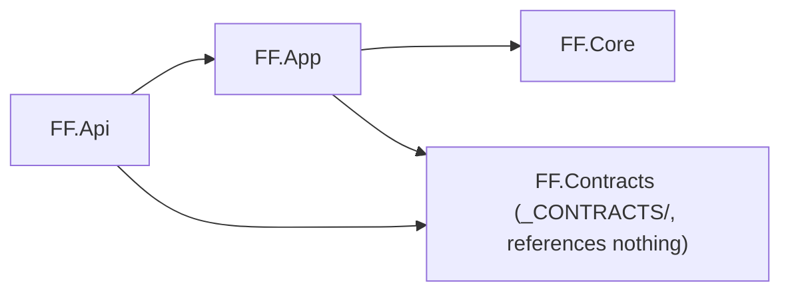

# Soft-extract a feature

Move one business capability out of shared monolith code paths into `Features/<Name>Feature/`. Old and new paths coexist; nothing existing breaks; every move is pinned by a test. Reference module: `FF.Api/Features/FactoringFeature/`. Copy its shape, don't invent one.

## Terms

| Term | Means |
|---|---|
| Domain project / Application project | Solution-level project type set by `[FtbProject]` (`FF.Core` / `FF.App`) |
| feature's Domain folder | `Features/<Name>Feature/Domain/` |
| call site | Existing monolith code that branches on the feature today |
| characterization test | Test pinning *current* behavior, known-wrong parts included |

Always say "Domain project" or "feature's Domain folder", never bare "Domain".

## Rules (hold for the whole session)

**1. Characterize before you move.** No branch is refactored until a test pins it against the untouched code. Known-wrong behavior is pinned as-is with a comment, not fixed mid-extraction.

```csharp
// ✓ pins today's behavior; the fix is a separate change after extraction
// Known bug: factoring loans skip the overdue fee. Pinned as-is during extraction.
result.OverdueFee.Should().Be(0m);
```

**2. Place code where its call site can reach it.** References flow one way, and that decides which project a file lives in:



* Code replacing a branch inside `FF.App` lives in `FF.App` (or `FF.Core`), or sits behind an interface the call site can reach (`FF.App` or `FF.Contracts`) with the implementation in the feature folder in `FF.Api`, resolved through DI:

```
_CONTRACTS/Integrations/IHubSpotDataMapper.cs             declares IHubSpotDataMapper<T>   (FF.Contracts)
FF.App/Services/HubSpot/Data/HubSpotDataClient.cs         resolves it                      (FF.App)
FF.Api/Features/FactoringFeature/Integration/
    FactoringHubSpotDataMapper.cs                         implements it                    (FF.Api)
FactoringServiceExtensions.cs                             registers it in DI
```

* ✗ `FF.App` code calling `new FactoringHubSpotDataMapper()` → doesn't compile.
* Free to live in `FF.Api`: the REST layer, and anything with no existing call site (a new entity).
* One feature can span two projects; read the `ProjectReference`s in each `.csproj` before the first file.

**3. Feature entities get their own `DbContext`.** Never a `DbSet` on `FFCoreDbContext`. Monolith entities are referenced by plain `int` FK:

```csharp
// ✗ can't join across contexts; drags FF.Core into the feature's Domain folder
public Business Business { get; private set; }
// ✓
public int BusinessId { get; private set; }
```

**4. No exceptions for expected outcomes.** Business results are return values; `throw` only for the unexpected. No `Result<T>` or response-wrapper type.

| Caller needs to know | Return | Factoring example |
|---|---|---|
| Did it happen? | object, `null` if not | `Task<Factoring?> Create(...)` → controller maps `null` to `Conflict()` |
| Was the change applied? | `bool` from a domain method | `bool Factoring.ChangeStatus(FactoringStatus newStatus)` |
| Not found vs rejected with a reason | `(object, error)` tuple | `Task<(Factoring? Factoring, string? Error)> ChangeStatus(...)` → `NotFound()` / `BadRequest(new { error })` |

**5. Smallest correct form first.** A function before a class. Promote only for state, DI, or a second implementation.

```csharp
// ✗ interface + class + registration for one formula
interface IOverdueFeeCalculator { decimal Calculate(decimal principal, int daysOverdue); }
// ✓
internal static decimal CalculateOverdueFee(decimal principal, int daysOverdue) { ... }
```

**6. Business-critical constants live in `_CRITICAL/`** as `internal static` classes holding the whole rule set (country/currency enablement, money thresholds, eligibility gates, status enums), not inline on the consuming type:

```csharp
// FF.Api/Features/FactoringFeature/_CRITICAL/LoanNumberFormat.cs
internal static class LoanNumberFormat
{
    public const int PrefixLength = 6;
    public const int DigitCount = 12;
    public static readonly string[] ValidPrefixes = ["LDKDKK", "LNONOK"];
}
```

## Module layout

```
FF.Api/Features/<Name>Feature/
├── _CRITICAL/                    business-critical constants + enums (rule 6)
├── _DTO/                         request/response types; validated before reaching the Domain folder
├── Domain/                       plain classes: no FF.Core, Ftb or EF Core types
├── Application/<Name>Service.cs  only real orchestration of Domain + adapters; no pass-through
├── Infrastructure/               <Name>DbContext, Migrations/, outbox: persistence coupling only
├── Integration/                  3rd-party adapters (HubSpot mapper, client): vendor coupling only
├── API/REST/                     <Name>Controller.cs           [ApiController], ctor, fields
│                                 <Name>Controller.Commands.cs  write actions (partial)
│                                 <Name>Controller.Queries.cs   read actions (partial)
└── <Name>ServiceExtensions.cs    Add<Name>Feature + Migrate<Name>Feature
FF.Tests/Features/<Name>Feature/  one test class per concern (domain, service, persistence, controller)
```

* REST (MVC), not GraphQL, unless the feature needs GraphQL.
* Monolith coupling lives only in `Infrastructure/` and `Integration/`.

## Process

Copy this checklist and tick it off:

```
- [ ] 1. Map every behavioral branch (file:line table)
- [ ] 2. Pin each branch with a characterization test (green on untouched code)
- [ ] 3. Lay out the module in the project(s) rule 2 dictates
- [ ] 4. Own DbContext + schema + migrations, migrated from Program.TryMigrateDatabase
- [ ] 5. One Add<Name>Feature call in Startup.cs
- [ ] 6. Move one branch per commit; characterization tests pass unchanged
```

**1. Map the surface.** Grep the flag, enum or string that distinguishes the feature across API surface, 3rd-party mappers, jobs and tests:

```bash
rg -n "ProductType\.FactoringCode|\"FCT\"" --type cs
```

Record each branch; the smallest, most isolated one is the first slice:

| Branch | Behavior | Test today |
|---|---|---|
| `FF.App/Loans/EventProcessors/CreateApiLoanApplicationHandler.cs:93` | rejects factoring for non-FlexFunding partners | check → write one if none |
| `FF.App/Services/HubSpot/Data/HubSpotDataMappers.cs:180` | factoring deal stage + pipeline | check → write one if none |

→ verify: every branch has a `file:line`, not just the obvious one.

**2. Pin behavior.** For each uncovered branch, write a characterization test against the current code (use the `tests-as-documentation` skill). No seam to test against? Extract a minimal interface with zero behavior change, so old and new implementations share one contract.
→ verify: the test passes against the untouched implementation.

**3. Lay out the module** per the layout above, in the project(s) rule 2 dictates.
→ verify: the feature's Domain folder has no `FF.Core`, `Ftb` or `Microsoft.EntityFrameworkCore` usings:

```bash
rg -n "using (FF\.Core|Ftb|Microsoft\.EntityFrameworkCore)" FF.Api/Features/<Name>Feature/Domain
```

**4. Own persistence.** `<Name>DbContext` with its own schema and a migrations-history table inside that schema, registered in `Add<Name>Feature`:

```csharp
services.AddDbContext<FactoringDbContext>(options => options
    .UseSqlServer(connectionString, sql => sql
        .MigrationsHistoryTable("__EFMigrationsHistory", "factoring")));
```

* Feature migrations don't auto-run: `DatabaseMigrator` only migrates `FFCoreDbContext`. Without the next line, build, `migrations add` and tests all pass while the schema is never created in any environment.

```csharp
// FF.Api/Program.cs, TryMigrateDatabase, after databaseMigrator.Migrate()
await serviceProvider.Migrate<Name>Feature();
```

* Scaffold from `API/FF-API/`, then read the generated file before keeping it:

```bash
dotnet ef migrations add Initial<Name>Schema --context <Name>DbContext --project FF.Api --output-dir Features/<Name>Feature/Infrastructure/Migrations
```

→ verify: the migration touches only the feature schema (`rg -n "schema:" <migration>.cs` shows one value), and `TryMigrateDatabase` calls `Migrate<Name>Feature`.

**5. Wire it in with one call.** Every registration lives in `<Name>ServiceExtensions.cs`; `Startup.cs` gets only:

```csharp
services.AddFactoringFeature(Program.ConfigSettings.ConnectionStrings.FFApiDbConnection, ...);
```

→ verify: `git diff FF.Api/Startup.cs` adds exactly one call (plus its `using`).

**6. Move behavior in the smallest safe increments.** One branch per commit: extract the logic into the module, then repoint the *existing* call site at it. Never delete the old inline code and add the module in the same commit as anything else.
* A characterization test that needs editing means behavior moved, not just location: stop and fix the move.
→ verify after each increment: the step 2 tests pass unchanged, and the full suite is green (`test-runner` agent, or `dotnet test FF.Tests/FF.Tests.csproj`).
