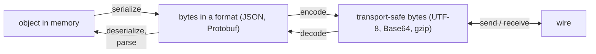

# Data Formats

What the bytes mean: formats, encodings, dates, security primitives, files and media.

## Contents

1. Formats: pick by consumer
2. Terms: serialize, encode, parse, compress
3. Text and charsets
4. Base64
5. Dates and time
6. Hashing, encryption, signatures, certificates
7. Files: multipart/form-data
8. Media: images, audio, video

## 1. Formats

The same record in four formats:

```
JSON      {"name":"Ada","age":36}                           23 bytes, self-describing
CSV       name,age⏎Ada,36                                   header row + one line per record
XML       <person><name>Ada</name><age>36</age></person>    46 bytes
Protobuf  0A 03 41 64 61 10 24                              7 bytes: field 1 = "Ada", field 2 = 36; needs the .proto to read
```

| Format | Nesting | Types | Schema | Pick for |
|---|---|---|---|---|
| JSON | yes | string, number, bool, null, array, object | optional (JSON Schema) | the default for APIs and events |
| XML | yes, + attributes | text only | XSD | SOAP, legacy systems, documents |
| CSV | no: flat rows | text only | none (header row) | tabular exports and imports, spreadsheets |
| YAML | yes | inferred | optional | human-edited config |
| Protobuf | yes | typed | required (`.proto`) | gRPC, high-volume internal traffic |
| MessagePack | yes | typed | none | compact JSON-like data without a schema |
| Avro | yes | typed | required, schema registry | Kafka with schema evolution |
| BSON | yes | + dates, binary | none | MongoDB |
| Raw binary (`.bin`, `.dat`, `.img`) | — | bytes | the program's own layout | images, firmware, custom protocols |

* Protobuf vs MessagePack: Protobuf when you want strong schema validation and compatibility rules; MessagePack when you only want compactness.
* JSON traps:
   * Numbers are doubles in JavaScript: ids above 2⁵³ (Twitter-style snowflakes, `long` keys) silently change. Send them as strings.
   * Money never as a float: integer minor units (`"amountCents": 4900`) or a decimal string, plus a currency.
* CSV traps:
   * Quote fields that contain the delimiter, quotes or newlines: `"Copenhagen, DK"`.
   * Danish and other European Excel locales use `;` as the delimiter and `,` as the decimal separator.
   * Excel needs a UTF-8 BOM to show `æøå` correctly.
   * Use a parser (CsvHelper), never `line.Split(',')`.
* YAML traps: unquoted `no`, `on`, `off` become booleans in YAML 1.1 parsers (`country: NO` → `false`); `012` can become octal. Quote strings.
* XML traps: disable DTD processing on untrusted input (XXE attacks); `System.Xml.Linq` with default settings is safe.

## 2. Terms



* Encoding (UTF-8, Base64, URL percent-encoding, gzip) follows a public rule: anyone can decode it, so it's never security.
* Parse into structured data (`JsonDocument.Parse`, a typed DTO); never search the raw string.
* Compression: lossless (gzip, brotli, zstd) for data and text, lossy (JPEG, MP3, H.264) only for media. Trade-offs: Lossless vs Lossy, Compression vs Time.

## 3. Text and charsets

* UTF-8 on the wire and on disk (files, HTTP, JSON, databases); .NET and JavaScript strings are UTF-16 in memory.
* Mojibake: `æ` is `C3 A6` in UTF-8; decoded as Latin-1 those bytes read `æ`. Fix it by declaring the charset (`Content-Type: application/json; charset=utf-8`), not by replacing characters.
* .NET: `StreamWriter` with `Encoding.UTF8` writes a BOM (`EF BB BF`), which breaks some parsers. Pass `new System.Text.UTF8Encoding(false)` unless the consumer is Excel.
* URL encoding: `æ` → `%C3%A6`, space → `%20` (`+` in form bodies). Use `System.Uri.EscapeDataString`, never string concatenation.
* SSE carries UTF-8 text only; WebSockets carry text or binary.

## 4. Base64

* Every 3 bytes become 4 characters: +33% size. base64url (`- _`, no padding) in URLs and JWTs.
* Needed when binary must travel through a text-only channel: email attachments (SMTP was 7-bit ASCII), binary inside JSON or XML, data URIs (``).
* Don't store images as Base64 in a database (+33% size, no streaming), and don't inline images except tiny icons: inlined images can't be cached by the browser and aren't indexed by search engines.
* A vendor sends Base64? Decode once in the adapter, store the bytes in blob storage, and pass a URL on.

## 5. Dates and time

| Kind | Store and send as | C# |
|---|---|---|
| An instant (something happened) | UTC, ISO 8601: `2026-10-02T09:45:12.123Z` | `System.DateTimeOffset.UtcNow`, format `"O"` |
| A future local time | local time + IANA zone: `2027-03-30T09:00` + `Europe/Copenhagen` | `System.TimeZoneInfo.FindSystemTimeZoneById("Europe/Copenhagen")` |
| A date without time | `2026-10-02` | `System.DateOnly` |
| A duration | a number with the unit in the name, or ISO 8601 | `timeoutSeconds = 30`, `PT30S` |

* ISO 8601: most significant unit first, `T` separates date and time, `Z` means UTC. Strings in the same format and zone sort chronologically as plain text.
* Future local times keep the zone, not a UTC offset: DST rules change by law, and the meeting must stay at 09:00 local.
* Convert to the user's local time only at the edge (UI, emails).
* Traps:
   * `DateTime.Now` on a server gives the server's zone. Use UTC.
   * `DateTime.Parse("02/10/2026")` is October 2 or February 10 depending on the culture. Parse with an explicit format and `CultureInfo.InvariantCulture`.
   * JavaScript: `new Date('2026-10-02')` is UTC midnight, but `new Date('2026-10-02T00:00')` is local midnight.
   * Unix time: seconds or milliseconds? (`Date.now()` is ms, `time()` is s.) Name it: `createdAtEpochSeconds`.
   * DST: at the spring change 02:30 doesn't exist; in the autumn it happens twice. Schedule in UTC.
   * Clocks on two machines drift apart (sync them with NTP). Don't order events from different machines by timestamp: use sequence numbers or broker offsets.

## 6. Hashing, encryption, signatures, certificates

| Primitive | Direction | Purpose | Example |
|---|---|---|---|
| Hash (SHA-256) | one-way | integrity, fingerprints, dedupe keys | file checksum, `ETag` |
| Password hash (Argon2id, bcrypt, PBKDF2) | one-way, slow, salted | store passwords | ASP.NET Core Identity `PasswordHasher<T>` |
| HMAC-SHA256 | one-way with a shared secret | prove who sent it and that it wasn't changed | webhook signatures |
| Symmetric encryption (AES-GCM) | two-way, one key | confidentiality at rest | encrypted columns, files |
| Asymmetric (RSA, ECDSA) | key pair | key exchange, signatures | TLS handshake, JWT `RS256`, code signing |
| Certificate | binds a public key to an identity, signed by a CA | trust | TLS (DV, OV, EV), client certificates (mTLS) |

* Never store passwords with plain SHA-256 or with encryption: a fast hash is brute-forced, and an encrypted password can be decrypted.
* SSL is deprecated; use TLS 1.2+, preferably 1.3. HTTPS, SMTPS/STARTTLS, IMAPS, POP3S and FTPS are the plain protocol wrapped in TLS. SFTP is a different protocol (file transfer over SSH), not FTP + TLS.
* Other certificate uses: code signing, S/MIME email, document signing, device (IoT) certificates, EU qualified certificates for legal signatures (eIDAS).

## 7. Files: multipart/form-data

```
POST /v1/invoices/inv_9/attachments
Content-Type: multipart/form-data; boundary=----b7

------b7
Content-Disposition: form-data; name="description"

Signed contract
------b7
Content-Disposition: form-data; name="file"; filename="contract.pdf"
Content-Type: application/pdf

%PDF-1.7 …binary…
------b7--
```

* One request carries text fields and binary files, each part with its own headers.
* The client's `filename` and `Content-Type` are attacker-controlled:
   * `Path.Combine(uploadsFolder, file.FileName)` with `..\..\appsettings.json` is path traversal.
   * A `.exe` renamed to `.png` still claims `image/png`.
* Rules, applied in `_DTO` before the domain:
   * Size limit, enforced by the server too (`FormOptions.MultipartBodyLengthLimit`, Kestrel `MaxRequestBodySize`).
   * Allowed types checked against magic bytes: `%PDF` = `25 50 44 46`, PNG = `89 50 4E 47`, JPEG = `FF D8 FF`.
   * Stored name = generated id. Keep the original name only as metadata.
   * Store in blob storage, not the web root or the database. Serve through a short-lived SAS URL or a CDN.
   * Large files: stream instead of buffering in memory, or let the client upload straight to blob storage with a SAS URL.

```csharp
using aspnet = Microsoft.AspNetCore.Http;
using collections = System.Collections.Generic;

var uploadConfig = new {
    maxSizeBytes = 5L * 1024 * 1024, // 5 MB
    signatures = new collections.Dictionary<string, byte[]> {
        ["application/pdf"] = [0x25, 0x50, 0x44, 0x46], // %PDF
        ["image/png"] = [0x89, 0x50, 0x4E, 0x47],
        ["image/jpeg"] = [0xFF, 0xD8, 0xFF],
    },
};

bool isAllowedFile(aspnet.IFormFile file) {
    if (file.Length == 0 || file.Length > uploadConfig.maxSizeBytes) return false;
    if (!uploadConfig.signatures.TryGetValue(file.ContentType, out var signature)) return false;

    using var stream = file.OpenReadStream();
    var header = new byte[signature.Length];
    if (stream.ReadAtLeast(header, header.Length, throwOnEndOfStream: false) < header.Length) return false;
    return header.AsSpan().SequenceEqual(signature);
}

var storedName = System.Guid.NewGuid().ToString("N"); // never file.FileName
```

* Alternatives: a raw `application/octet-stream` body for single-file APIs; Base64 inside JSON only for small files.

## 8. Media

* Images: serve by URL from blob storage or a CDN; resize on upload or on demand. Strip EXIF metadata from user uploads: it can hold the GPS position where the photo was taken. JPEG for photos (lossy), PNG for transparency and sharp edges (lossless), WebP/AVIF for smaller files.
* Audio and video: a codec (H.264/AAC, VP9/Opus) inside a container (MP4, WebM). Transcode with `ffmpeg`. Voice calls: VoIP or WebRTC.

| Protocol | Over | Latency | Use |
|---|---|---|---|
| Progressive download (HTTP range requests) | HTTP | — | short clips |
| HLS / MPEG-DASH | HTTP | 6–30 s (low-latency HLS ~2 s) | video on demand and live at scale through a CDN |
| RTMP | TCP | ~2–5 s | ingest from OBS or an encoder to a server; browsers don't play it |
| RTSP | TCP/UDP | low | IP cameras |
| WebRTC | UDP | < 1 s | calls, interactive live video |

* Adaptive bitrate (HLS, DASH): the video is cut into segments of a few seconds, each encoded at several bitrates. The player switches bitrate per segment as bandwidth changes.
   * Gains: smooth playback, scales through CDNs, cheaper per viewer at volume.
   * Costs: encoding time and storage for every bitrate, more moving parts. Trade-off: Speed vs Memory, paid back at scale.
